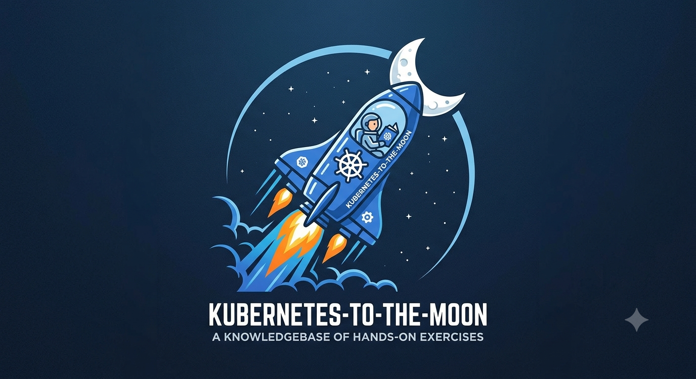

# Kubernetes to the Moon

Originally this repository was a collection of exercises I built using an AI Assistant to practice for the CKA exam and to explore AI-assisted learning. After passing the CKA I decided to keep going and rebranded it into a broader Kubernetes knowledge base. The goal is to build real operational fluency with Kubernetes through progressive topic-focused assignments, each consisting of a tutorial, exercises, and a complete answer key. The name is a subtle nod to the Kubestronaut program.

Browse the assignments in [`exercises/`](exercises/). All content targets **Kubernetes v1.35**.

---

## Generating New Content

New assignments are produced by two Claude Code skills in `.claude/skills/`.

**Step 1: Scope the topic** with `/k8s-prompt-builder`. This produces a topic-level `README.md` that determines how many assignments the topic needs and what each covers, then a `prompt.md` for each assignment.

**Step 2: Generate the assignment** with `/k8s-homework-generator`. This reads the `prompt.md` and produces the four content files (README, tutorial, homework, answers). This step must be run via the Agent tool, not inline.

The assignment registry at `.claude/skills/k8s-prompt-builder/references/assignment-registry.md` tracks everything that exists and everything planned.

---

## License

Apache License, Version 2.0. See `LICENSE` for the full text.
