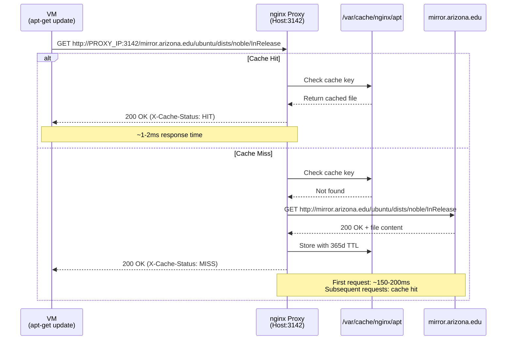
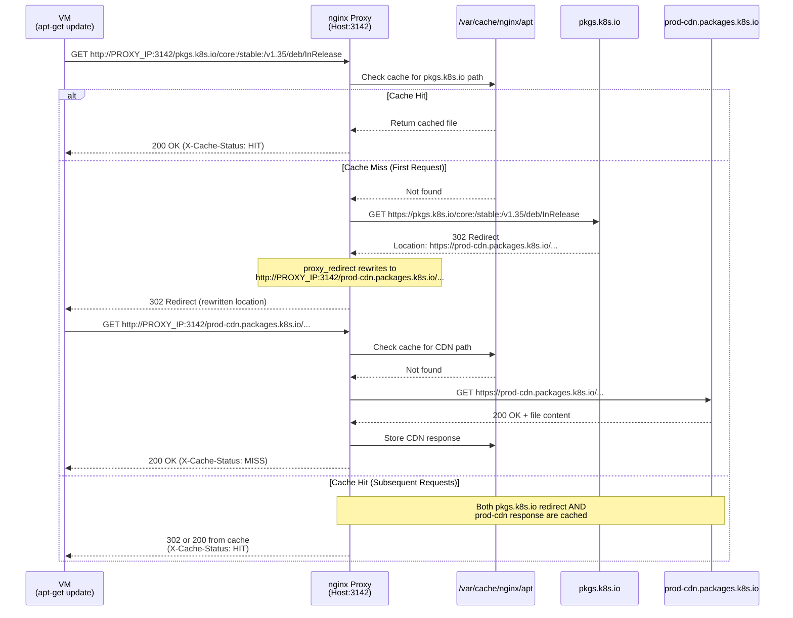
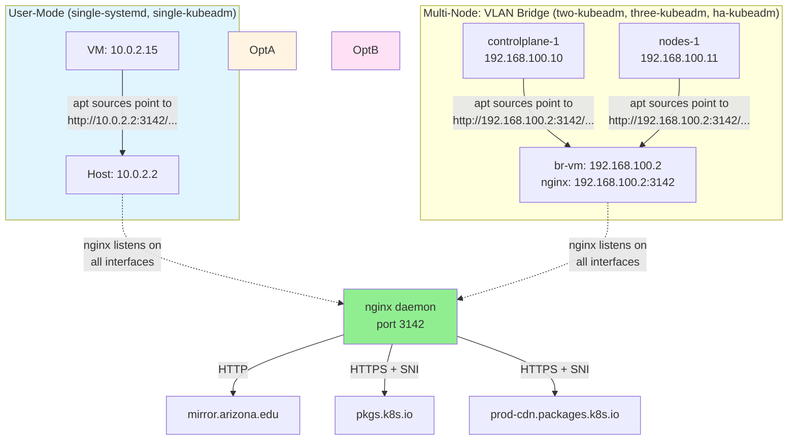

# APT Caching Proxy for Faster Cluster Rebuilds (Optional)

When Ubuntu's package infrastructure is under load, `apt-get update` and `apt-get install` inside the VMs can stall, time out, or fail entirely. If you are doing repeated cluster rebuilds (tearing down VMs and provisioning new ones to practice the init workflow), the same packages are re-fetched from upstream on every run even though they rarely change.

nginx can act as a caching reverse proxy for apt repositories. Install it once on the host, configure VMs to use it, and apt packages are fetched from upstream only on the first download. Every subsequent rebuild reads the same packages from the host's local cache, bypassing upstream entirely.

**What is and is not cached:** nginx proxies both HTTP and HTTPS backends. Ubuntu 24.04 packages (`containerd`, `socat`, `conntrack`, `curl`, and the cloud-init utility packages) are cached from the Ubuntu mirror. Kubernetes packages (`kubelet`, `kubeadm`, `kubectl`, `cri-tools`) are now also cacheable because nginx can proxy HTTPS repositories like `pkgs.k8s.io`. Ubuntu Pro/ESM repositories bypass the proxy to preserve token authentication.

**Network mode note:** The guides use two VM networking modes, which determine the host IP that VMs use to reach the proxy.

- Single-node guides (`single-systemd`, `single-kubeadm`) use QEMU user-mode networking. The host is reachable from inside the VM at `10.0.2.2`.
- Multi-node guides (`two-kubeadm`, `three-kubeadm`, `ha-kubeadm`) attach VMs to a VLAN-isolated host bridge (`br-vm`). The host bridge IP is `192.168.100.2`. Use that address wherever `PROXY_IP` appears in this document.

## Network Flow Architecture

The following diagrams show how APT traffic flows through the nginx proxy for different package sources and networking modes.

### Ubuntu Package Flow



### Kubernetes Package Flow (with CDN Redirect)



### Networking Mode Topology



### Key Behaviors

| Scenario | First Request | Subsequent Requests | Client Sees |
|----------|---------------|---------------------|-------------|
| Ubuntu packages via mirror.arizona.edu | nginx fetches from HTTP mirror, caches response | nginx serves from cache (365d TTL) | `Hit:N http://PROXY_IP:3142/mirror.arizona.edu/ubuntu` |
| Kubernetes packages via pkgs.k8s.io | nginx fetches HTTPS, receives 302 redirect to CDN, rewrites Location header, client follows to proxied CDN URL | Both redirect and CDN response served from cache | `Hit:N http://PROXY_IP:3142/pkgs.k8s.io/core:/stable:/v1.35/deb` |
| Cache after first boot | `apt-get update` takes 40-50 seconds | `apt-get update` takes <1 second (all cache hits) | All repositories show "Hit" status |

**Critical configuration elements:**
- `proxy_redirect` rewrites upstream redirects to keep traffic flowing through the proxy instead of bypassing it to go directly to the CDN.
- Kubernetes GPG key must be fetched through the same proxy path as the repository metadata to ensure signature consistency.
- `resolver` directive enables nginx to resolve HTTPS backend hostnames (required for `proxy_pass` with variables).
- `proxy_ssl_server_name on` enables SNI for CloudFront/CDN backends that serve multiple domains on the same IP.

---

## Prerequisites

- Ubuntu 24.04 LTS host with one of the VM guides partially or fully completed.
- The VMs are provisioned but the cluster is being rebuilt repeatedly (the cache provides no benefit on a first-time build).

---

## Part 1: Install and Configure nginx on the Host

### Install nginx

```bash
sudo apt-get update
sudo apt-get install -y nginx
```

### Create nginx cache configuration

```bash
sudo tee /etc/nginx/sites-available/apt-cache > /dev/null << 'EOF'
# nginx APT Caching Proxy Configuration
# Listens on port 3142, caches HTTPS backends

# Cache storage path
proxy_cache_path /var/cache/nginx/apt
    levels=1:2
    keys_zone=apt_cache:100m
    max_size=50g
    inactive=365d
    use_temp_path=off;

server {
    listen 3142;
    server_name _;

    # DNS resolver - CRITICAL for HTTPS backend resolution
    # Replace 192.168.2.1 with your local gateway/router IP
    resolver 192.168.2.1 8.8.8.8 valid=30s;
    resolver_timeout 10s;

    access_log /var/log/nginx/apt-cache-access.log;
    error_log /var/log/nginx/apt-cache-error.log;
    
    # Global cache settings
    proxy_cache apt_cache;
    proxy_cache_valid 200 365d;
    proxy_cache_valid 404 1h;
    proxy_cache_use_stale error timeout updating http_500 http_502 http_503 http_504;
    proxy_cache_lock on;
    
    # HTTP/1.1 settings
    proxy_http_version 1.1;
    proxy_set_header Host $proxy_host;
    proxy_set_header Connection "";
    
    # SSL/TLS settings - CRITICAL for HTTPS backends
    proxy_ssl_server_name on;
    proxy_ssl_name $proxy_host;
    proxy_ssl_protocols TLSv1.2 TLSv1.3;
    
    # Timeouts - 30s connect timeout handles slow SSL handshakes
    proxy_connect_timeout 30s;
    proxy_send_timeout 300s;
    proxy_read_timeout 300s;
    
    # Kubernetes (pkgs.k8s.io)
    location ~ ^/pkgs\.k8s\.io/(.*)$ {
        proxy_pass https://pkgs.k8s.io/$1$is_args$args;
        proxy_intercept_errors off;
        # Rewrite redirects to prod-cdn.packages.k8s.io to go through proxy
        proxy_redirect https://prod-cdn.packages.k8s.io/ http://$http_host/prod-cdn.packages.k8s.io/;
        add_header X-Cache-Status $upstream_cache_status;
    }
    
    # Kubernetes CDN redirect (prod-cdn.packages.k8s.io)
    location ~ ^/prod-cdn\.packages\.k8s\.io/(.*)$ {
        proxy_pass https://prod-cdn.packages.k8s.io/$1$is_args$args;
        add_header X-Cache-Status $upstream_cache_status;
    }
    
    # Ubuntu - Arizona mirror (FAST - HTTP backend)
    location ~ ^/mirror\.arizona\.edu/(.*)$ {
        proxy_pass http://mirror.arizona.edu/$1$is_args$args;
        add_header X-Cache-Status $upstream_cache_status;
    }
    
    # Fallback - reject anything else
    location / {
        return 404 "Repository not configured for caching";
    }
}
EOF
```

**DNS resolver note:** The `resolver` directive must include DNS servers that can resolve upstream hostnames. Replace `192.168.2.1` with your local gateway/router IP, or use public DNS (8.8.8.8, 1.1.1.1) if your network doesn't provide DNS.

**Mirror selection:** `mirror.arizona.edu` is used instead of `archive.ubuntu.com` or `us.archive.ubuntu.com` because testing shows significantly better performance (0.16s vs 19-22s for InRelease fetches). If you are outside the US, substitute a closer mirror from the [Ubuntu mirror list](https://launchpad.net/ubuntu/+cdmirrors).

### Enable the configuration

```bash
# Create symlink to enable site
sudo ln -s /etc/nginx/sites-available/apt-cache /etc/nginx/sites-enabled/

# Test configuration
sudo nginx -t

# Reload nginx
sudo systemctl reload nginx

# Verify nginx is listening on port 3142
sudo ss -tlnp | grep :3142
```

### Create cache directory

```bash
# nginx will create this automatically, but you can pre-create it
sudo mkdir -p /var/cache/nginx/apt
sudo chown www-data:www-data /var/cache/nginx/apt
```

---

## Part 2: Point VMs at the Proxy

VMs need their apt sources files rewritten to use the nginx proxy. The format is `http://PROXY_IP:3142/domain.com/path` instead of the original `https://domain.com/path`. There are two approaches: manual configuration after the VM boots, or baked into cloud-init for new VMs.

### Manual Configuration (Post-Boot)

SSH into the VM and rewrite the sources files. Use the correct host IP for the networking mode the VM was built with.

**For single-node guides (QEMU user-mode networking, host at `10.0.2.2`):**

```bash
# Ubuntu base packages
sudo tee /etc/apt/sources.list.d/ubuntu.sources > /dev/null << 'EOF'
Types: deb
URIs: http://10.0.2.2:3142/mirror.arizona.edu/ubuntu/
Suites: noble noble-updates noble-backports
Components: main restricted universe multiverse
Signed-By: /usr/share/keyrings/ubuntu-archive-keyring.gpg

Types: deb
URIs: http://10.0.2.2:3142/mirror.arizona.edu/ubuntu/
Suites: noble-security
Components: main restricted universe multiverse
Signed-By: /usr/share/keyrings/ubuntu-archive-keyring.gpg
EOF

# Kubernetes packages (if the repo has already been added)
sudo tee /etc/apt/sources.list.d/kubernetes.sources > /dev/null << 'EOF'
Types: deb
URIs: http://10.0.2.2:3142/pkgs.k8s.io/core:/stable:/v1.35/deb/
Suites: /
Components:
Signed-By: /etc/apt/keyrings/kubernetes-apt-keyring.gpg
EOF
```

**For multi-node guides (VLAN bridge, host bridge `br-vm` at `192.168.100.2`):**

```bash
# Ubuntu base packages
sudo tee /etc/apt/sources.list.d/ubuntu.sources > /dev/null << 'EOF'
Types: deb
URIs: http://192.168.100.2:3142/mirror.arizona.edu/ubuntu/
Suites: noble noble-updates noble-backports
Components: main restricted universe multiverse
Signed-By: /usr/share/keyrings/ubuntu-archive-keyring.gpg

Types: deb
URIs: http://192.168.100.2:3142/mirror.arizona.edu/ubuntu/
Suites: noble-security
Components: main restricted universe multiverse
Signed-By: /usr/share/keyrings/ubuntu-archive-keyring.gpg
EOF

# Kubernetes packages (if the repo has already been added)
sudo tee /etc/apt/sources.list.d/kubernetes.sources > /dev/null << 'EOF'
Types: deb
URIs: http://192.168.100.2:3142/pkgs.k8s.io/core:/stable:/v1.35/deb/
Suites: /
Components:
Signed-By: /etc/apt/keyrings/kubernetes-apt-keyring.gpg
EOF
```

**Ubuntu Pro/ESM repositories:** Leave `ubuntu-esm-apps.sources` and `ubuntu-esm-infra.sources` unchanged. They must remain as `https://esm.ubuntu.com` to preserve token authentication.

**Verify:**

```bash
sudo apt-get update
```

On the first run, the cache is empty and packages are fetched from upstream (slow). On the second run, the cache is warm and updates complete in 1-2 seconds.

### cloud-init (New VMs)

If you are creating a fresh VM and want the proxy active from the first `apt-get` call, add `write_files` entries to the cloud-init `user-data` for the node. Cloud-init applies `write_files` before it installs packages listed in the `packages:` block, so the cloud-init-time installs also use the cache.

The `two-kubeadm/scripts/create-cluster.sh` script already includes these source rewrites in cloud-init. For manual VM provisioning (three-kubeadm, ha-kubeadm), add the `write_files` entries to your `user-data`.

**For single-node guides (user-mode networking):**

```yaml
  - path: /etc/apt/sources.list.d/ubuntu-proxy.sources
    content: |
      Types: deb
      URIs: http://10.0.2.2:3142/mirror.arizona.edu/ubuntu/
      Suites: noble noble-updates noble-backports
      Components: main restricted universe multiverse
      Signed-By: /usr/share/keyrings/ubuntu-archive-keyring.gpg
      
      Types: deb
      URIs: http://10.0.2.2:3142/mirror.arizona.edu/ubuntu/
      Suites: noble-security
      Components: main restricted universe multiverse
      Signed-By: /usr/share/keyrings/ubuntu-archive-keyring.gpg
    permissions: '0644'
  - path: /etc/apt/sources.list.d/kubernetes.sources
    content: |
      Types: deb
      URIs: http://10.0.2.2:3142/pkgs.k8s.io/core:/stable:/v1.35/deb/
      Suites: /
      Components:
      Signed-By: /etc/apt/keyrings/kubernetes-apt-keyring.gpg
    permissions: '0644'
```

**For multi-node guides (VLAN bridge, host bridge at `192.168.100.2`):**

```yaml
  - path: /etc/apt/sources.list.d/ubuntu-proxy.sources
    content: |
      Types: deb
      URIs: http://192.168.100.2:3142/mirror.arizona.edu/ubuntu/
      Suites: noble noble-updates noble-backports
      Components: main restricted universe multiverse
      Signed-By: /usr/share/keyrings/ubuntu-archive-keyring.gpg
      
      Types: deb
      URIs: http://192.168.100.2:3142/mirror.arizona.edu/ubuntu/
      Suites: noble-security
      Components: main restricted universe multiverse
      Signed-By: /usr/share/keyrings/ubuntu-archive-keyring.gpg
    permissions: '0644'
  - path: /etc/apt/sources.list.d/kubernetes.sources
    content: |
      Types: deb
      URIs: http://192.168.100.2:3142/pkgs.k8s.io/core:/stable:/v1.35/deb/
      Suites: /
      Components:
      Signed-By: /etc/apt/keyrings/kubernetes-apt-keyring.gpg
    permissions: '0644'
```

**Use cloud-init's native apt.sources configuration:**

Cloud-init 23.4+ supports DEB822 format via the `sources_list` parameter. This is cleaner than manual write_files:

```yaml
ssh_pwauth: true

apt:
  sources:
    ubuntu-proxy.sources:
      sources_list: |
        Types: deb
        URIs: http://192.168.100.2:3142/mirror.arizona.edu/ubuntu/
        Suites: noble noble-updates noble-backports
        Components: main restricted universe multiverse
        Signed-By: /usr/share/keyrings/ubuntu-archive-keyring.gpg

        Types: deb
        URIs: http://192.168.100.2:3142/mirror.arizona.edu/ubuntu/
        Suites: noble-security
        Components: main restricted universe multiverse
        Signed-By: /usr/share/keyrings/ubuntu-archive-keyring.gpg
    kubernetes.sources:
      sources_list: |
        Types: deb
        URIs: http://192.168.100.2:3142/pkgs.k8s.io/core:/stable:/v1.35/deb/
        Suites: /
        Components:
        Signed-By: /etc/apt/keyrings/kubernetes-apt-keyring.gpg

packages:
  - curl
  - socat
  # ... other packages

runcmd:
  - rm -f /etc/netplan/50-cloud-init.yaml
  - netplan apply
  - rm -f /etc/apt/sources.list.d/ubuntu.sources  # Remove cloud image default
  - mkdir -p /etc/apt/keyrings
  - curl -fsSL https://pkgs.k8s.io/core:/stable:/v1.35/deb/Release.key | gpg --dearmor -o /etc/apt/keyrings/kubernetes-apt-keyring.gpg
  - apt-get update
  # ... rest of runcmd
```

**Requirements:**
- Cloud-init **23.4+** (Ubuntu 24.04 ships with 25.3)
- Uses `sources_list` parameter for DEB822 format

**Benefits over write_files:**
- Native cloud-init apt management
- Cleaner configuration
- Proper sources lifecycle management

---

## Part 3: Verification

### Check cache hit rate

```bash
# View cache statistics on the host
sudo grep -o 'X-Cache-Status: [A-Z]*' /var/log/nginx/apt-cache-access.log | sort | uniq -c
```

Expected output after a few VM rebuilds:
```
  150 X-Cache-Status: HIT
   50 X-Cache-Status: MISS
```

### Check cache size

```bash
sudo du -sh /var/cache/nginx/apt
```

### Monitor real-time requests

```bash
sudo tail -f /var/log/nginx/apt-cache-access.log
```

Watch for `HIT` vs `MISS` vs `UPDATING` in the `X-Cache-Status` header.

### Confirm DNS resolution is working

If cache misses persist or you see `no resolver defined to resolve` errors in the nginx error log, verify the resolver directive in `/etc/nginx/sites-available/apt-cache` matches your network's DNS server or use a public DNS (8.8.8.8, 1.1.1.1).

---

## Troubleshooting

**"no resolver defined to resolve X"**

nginx can't resolve upstream hostnames. Add or fix the `resolver` directive in the server block:

```nginx
resolver 192.168.2.1 8.8.8.8 valid=30s;
```

Replace `192.168.2.1` with your local gateway/router IP.

**"upstream timed out (110: Connection timed out)"**

SSL handshake takes longer than the default timeout. This is already set to 30s in the config above. If errors persist, increase `proxy_connect_timeout`:

```nginx
proxy_connect_timeout 60s;
```

**SSL handshake failures for CloudFront backends**

Some repositories use CloudFront CDNs that require SNI (Server Name Indication). This is already enabled in the config above via `proxy_ssl_server_name on;` and `proxy_ssl_name $proxy_host;`. If you encounter SSL errors, verify these directives are present.

**Kubernetes packages fail to download or bypass cache**

`pkgs.k8s.io` returns HTTP redirects to `prod-cdn.packages.k8s.io`. Without `proxy_redirect`, clients follow the redirect directly to the CDN and bypass the cache. The config above includes:

```nginx
proxy_redirect https://prod-cdn.packages.k8s.io/ http://$http_host/prod-cdn.packages.k8s.io/;
```

This rewrites redirect responses to point back through the proxy. If you see cache misses for Kubernetes packages or direct CDN connections in logs, verify this directive is present in the `pkgs.k8s.io` location block.

**Cache not populating**

Check nginx has write permissions to the cache directory:

```bash
ls -ld /var/cache/nginx/apt
# Should show: drwxr-xr-x root root or www-data www-data

# Check error log
sudo tail -50 /var/log/nginx/apt-cache-error.log
```

**Connection refused on port 3142 from inside the VM**

The service is not running or a host firewall is blocking the port. On the host:

```bash
systemctl status nginx --no-pager
ss -tlnp | grep 3142
```

If using `ufw` on the host:

```bash
sudo ufw allow 3142/tcp
```

**apt-get update returns 404 errors for some repositories**

The nginx config only includes location blocks for specific repositories. If you need to cache additional repositories, add a location block to `/etc/nginx/sites-available/apt-cache` following the pattern:

```nginx
    location ~ ^/domain\.com/(.*)$ {
        proxy_pass https://domain.com/$1$is_args$args;
        add_header X-Cache-Status $upstream_cache_status;
    }
```

Then reload nginx: `sudo systemctl reload nginx`

**Removing the proxy**

On the VM, restore the original sources files or delete the proxy-rewritten files and recreate them with the original `https://` URLs. Then run `sudo apt-get update` to restore direct connectivity. The nginx service on the host can be left running; it has no effect on VMs that do not have rewritten sources files.

---

## Summary

| Item | Value |
|------|-------|
| Cache daemon | nginx on host, port 3142 |
| Config file | `/etc/nginx/sites-available/apt-cache` |
| VM sources files | `ubuntu.sources`, `kubernetes.sources` (rewritten to use proxy URL format) |
| Proxy URL format | `http://HOST_IP:3142/domain.com/path` |
| Proxy address (user-mode networking, single-node guides) | `http://10.0.2.2:3142` |
| Proxy address (VLAN bridge, multi-node guides) | `http://192.168.100.2:3142` |
| Packages cached | Ubuntu HTTP repos, Kubernetes HTTPS repos |
| Packages bypassed (not cached) | Ubuntu Pro/ESM (token auth) |
| Access log | `/var/log/nginx/apt-cache-access.log` |
| Error log | `/var/log/nginx/apt-cache-error.log` |
| Cache storage | `/var/cache/nginx/apt` (50GB max, 365 day retention) |
