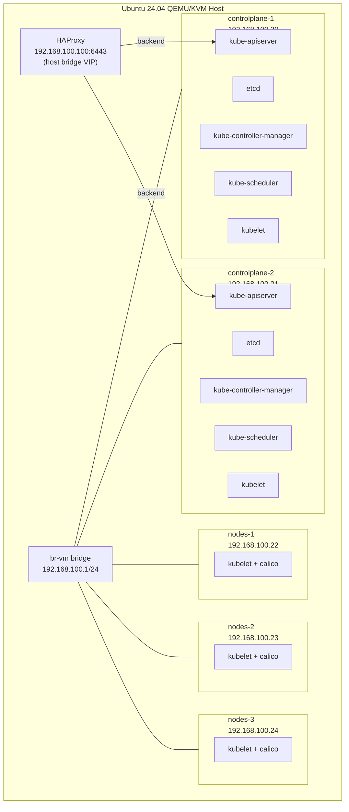

# CKA Exam Prep: Five-Node HA Kubernetes Cluster

This guide bootstraps a highly available Kubernetes cluster on QEMU/KVM virtual
machines using `kubeadm`: two control plane nodes with stacked etcd and three worker
nodes. A lightweight HAProxy instance on the host bridge serves as the control plane
load balancer.

This is the most complex setup in the cluster-setup collection. Work through the
simpler guides first:

| Guide | Nodes | Purpose |
|---|---|---|
| `single-kubeadm` | 1 | kubeadm basics |
| `two-kubeadm` | 1 CP + 1 worker | kubeadm join, multi-node basics |
| `three-kubeadm` | 1 CP + 2 workers | scheduling across workers |
| `ha-kubeadm` (this guide) | 2 CP + 3 workers | HA control plane, second control plane join |

## What You Will Build

Five QEMU/KVM VMs on a host-side Linux bridge with a host-side HAProxy load balancer
fronting both control plane nodes:

The stacked etcd topology means each control plane node runs its own etcd instance.
The two etcd members form a Raft quorum. Losing one control plane node leaves the
cluster operational with one etcd member (degraded quorum -- reads/writes work but no
further control plane failures can be tolerated until the node comes back).

## Prerequisites

**Hardware:**
- x86_64 CPU with hardware virtualization enabled (Intel VT-x or AMD-V)
- At least 40 GB RAM (4 GB per VM, 5 VMs, plus host overhead)
- 250 GB free disk space

**Host OS:**
- Ubuntu 24.04 LTS

**Prior experience:**
- Completed `two-kubeadm` or `three-kubeadm`. This guide assumes familiarity with
  kubeadm init, worker join, and Calico.
- Understanding of what etcd quorum means (a two-member etcd cluster tolerates zero
  failures -- one member down means no elections, reads continue but writes fail).

**Time estimate:** 2-2.5 hours from start to finish

## Guide Structure

### [00 - Overview](00-overview.md)

Quick reference: hostnames, IPs, VIP, version table, CIDR ranges, HAProxy design.

### [01 - Host Bridge Setup](01-host-bridge-setup.md)

Configures `br-vm`, IP forwarding, NAT, `qemu-bridge-helper`, and installs HAProxy on
the host to load balance the two API servers.

**Time:** 25-35 min. **Result:** `br-vm` at `192.168.100.1/24`, HAProxy listening on `192.168.100.100:6443`.

### [02 - VM Provisioning](02-vm-provisioning.md)

Creates five headless Ubuntu 24.04 VMs with cloud-init and static bridge IPs.

**Time:** 25-30 min. **Result:** Five VMs reachable via SSH, kubeadm prerequisites met.

### [03 - Node Prerequisites](03-node-prerequisites.md)

Installs containerd, runc, CNI binaries, crictl, and the kubeadm toolchain on all five
nodes.

**Time:** 15-20 min. **Result:** All five nodes have containerd and kubeadm at v1.35.3.

### [04 - Load Balancer Setup](04-load-balancer-setup.md)

Configures HAProxy on the host with health checks against both control plane API
servers. Verifies the VIP routes to the active control plane.

**Time:** 10-15 min. **Result:** `curl -k https://192.168.100.100:6443/healthz` returns `ok`.

### [05 - First Control Plane Init](05-control-plane-init.md)

Runs `kubeadm init` on `controlplane-1` with `--control-plane-endpoint` pointing to
the HAProxy VIP. Generates the certificate key for joining the second control plane.

**Time:** 15-20 min. **Result:** `controlplane-1` is `NotReady`, API accessible via VIP.

### [06 - CNI Installation](06-cni-installation.md)

Installs Calico via the Tigera operator. Removes the control-plane taint from
`controlplane-1`.

**Time:** 5-10 min. **Result:** `controlplane-1` goes `Ready`.

### [07 - Second Control Plane Join](07-second-control-plane-join.md)

Joins `controlplane-2` as a second control plane node using `kubeadm join --control-plane`.
Verifies that etcd has two members and that the API server on `controlplane-2` is
reachable through the HAProxy VIP.

**Time:** 10-15 min. **Result:** Both control planes `Ready`, etcd has two members.

### [08 - Worker Join](08-worker-join.md)

Joins `nodes-1`, `nodes-2`, and `nodes-3` using a freshly generated token. Verifies
cross-node networking and DaemonSet placement.

**Time:** 15-20 min. **Result:** All five nodes `Ready`.

### [09 - Cluster Services](09-cluster-services.md)

Installs local-path-provisioner, Helm, metrics-server, and optionally MetalLB.

**Time:** 5-10 min. **Result:** Complete five-node cluster.

## Component Versions

| Component | Version | Notes |
|-----------|---------|-------|
| Ubuntu (guest) | 24.04 LTS | Cloud image, headless |
| Kubernetes | v1.35.3 | CKA exam target version |
| containerd | Ubuntu 24.04 apt | |
| runc | Ubuntu 24.04 apt | containerd dependency |
| cri-tools (crictl) | v1.35.0 | |
| CNI plugins (binaries) | v1.7.1 | Required by Calico |
| Calico | v3.31.0 | Tigera operator install |
| HAProxy | 2.x (Ubuntu 24.04 default) | Host-only, not inside VMs |

## Network Layout

| CIDR / Address | Purpose | Where It Appears |
|----------------|---------|------------------|
| `192.168.100.0/24` | Lab-VMs VLAN 100, bridge `br-vm` | All VM IPs, host bridge at `192.168.100.2`, UCG-Fiber gateway at `192.168.100.1` |
| `192.168.100.100` | HAProxy VIP | `controlPlaneEndpoint` in kubeadm config, kubeconfigs, worker join command |
| `10.96.0.0/16` | Service ClusterIPs | `kubeadm` `serviceSubnet`, CoreDNS, kubelet `clusterDNS` |
| `10.244.0.0/16` | Pod IPs | `kubeadm` `podSubnet`, Calico IPPool |

## What This Guide Does Not Cover

- **External etcd.** Both control planes use stacked etcd (etcd on the same node as the
  API server). External etcd (separate etcd cluster) is more complex and not required
  for the CKA exam.
- **keepalived / VRRP.** The HAProxy VIP is a static alias on the host bridge. In
  production, keepalived would manage a floating IP between two load balancers. For a
  lab, the static host alias is sufficient.
- **Three-or-more control planes.** A third control plane node would give you a proper
  three-member etcd quorum (tolerates one failure). Two members is a valid lab setup
  but is not production-grade.

## Testing Status

- Last verified: 2026-05-02
- Platform: Ubuntu 24.04 LTS host
- Known issues: None

## Scripts Reference

| Script | Purpose | When to Use |
|--------|---------|-------------|
| `scripts/break-cluster-ha.sh` | Introduces HA-specific failures for practice | After completing the guide |
