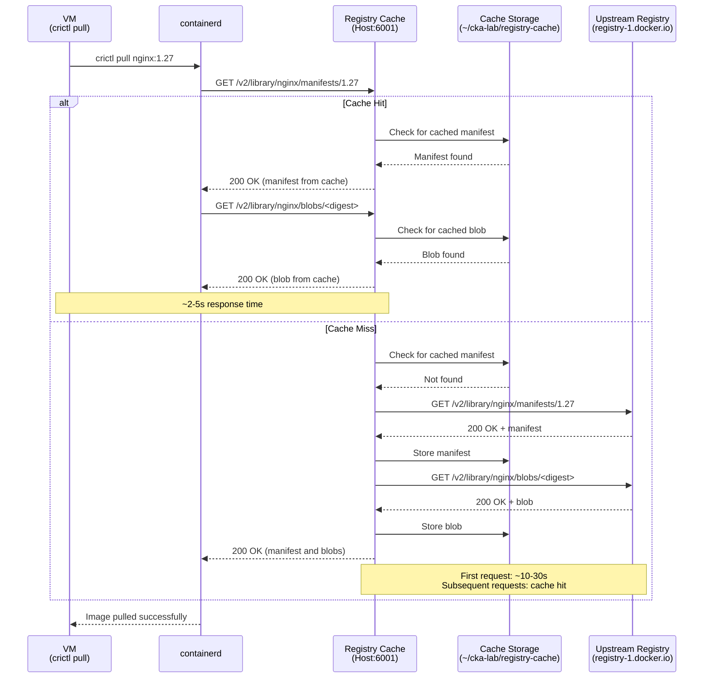
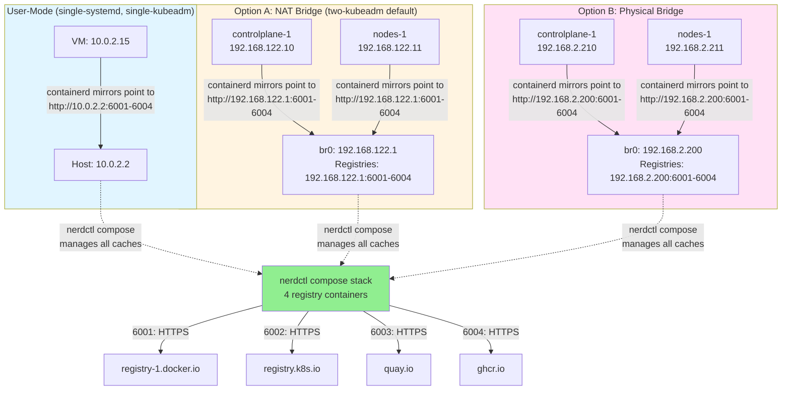

# Container Registry Caching for Faster Cluster Rebuilds (Optional)

When rebuilding Kubernetes clusters repeatedly to practice kubeadm operations, node join workflows, or upgrade procedures, the same container images are pulled from upstream registries every time. A fresh cluster init pulls pause containers, kube-apiserver, kube-controller-manager, kube-scheduler, kube-proxy, etcd, coredns, and any CNI plugin images. With application workloads (nginx, redis, busybox), the list grows longer. Each pull goes over the internet, and repeated rebuilds waste time and bandwidth.

Pull-through registry caches solve this. Install them once on the host, configure VMs to use them as registry mirrors, and container images are fetched from upstream only on the first pull. Every subsequent rebuild reads the same image layers from the host's local cache, bypassing upstream entirely.

**What is cached:** All container images pulled from docker.io (nginx, redis, busybox, rancher local-path-provisioner, some CNIs), registry.k8s.io (all Kubernetes components), quay.io (Calico, Cilium), and ghcr.io (GitHub packages). Four separate registry cache instances run on the host, one for each upstream registry, because the Docker Registry software can only proxy to a single upstream per instance.

**Network mode note:** The guides use several different VM networking modes, which determine the host IP that VMs use to reach the caches.

- Single-node guides (`single-systemd`, `single-kubeadm`) use QEMU user-mode networking. The host is reachable from inside the VM at `10.0.2.2`.
- Multi-node guides with **Option A** (software NAT bridge) assign `br0` the IP `192.168.122.1` and NAT VM traffic through the host uplink. The host bridge IP is `192.168.122.1`.
- Multi-node guides with **Option B** (physical NIC bridge) slave a spare NIC to `br0` and assign it a static IP in your physical LAN range. The host bridge IP is whatever you set in the Netplan config, for example `192.168.2.200`. Substitute that address wherever `192.168.122.1` appears in this document.

**Installation method note:** The CKA lab setup guides use two different containerd installation methods, which affect the runc binary location:

- Binary-cache guides (single-systemd, two-systemd) download containerd and runc from GitHub releases and install runc to `/usr/local/bin/runc`. Use this path in the configs below.
- Kubeadm guides (single-kubeadm, two-kubeadm, three-kubeadm, ha-kubeadm) install containerd via `apt install containerd`, which installs runc to `/usr/sbin/runc`. If you are using an apt-based setup, change `BinaryName = '/usr/local/bin/runc'` to `BinaryName = '/usr/sbin/runc'` in all configs below, or verify your existing runc path with `which runc`.

## Network Flow Architecture

The following diagrams show how container image pulls flow through the registry caches for different registries and networking modes.

### Container Image Pull Flow



### Networking Mode Topology



### Key Behaviors

| Scenario | First Request | Subsequent Requests | Evidence of Cache Hit |
|----------|---------------|---------------------|----------------------|
| docker.io images (nginx, redis, busybox) | Cache fetches from registry-1.docker.io, stores layers in `~/cka-lab/registry-cache/docker-io/` | Cache serves from local storage | Pull completes in 2-5s instead of 10-30s |
| registry.k8s.io images (pause, kube-apiserver, etcd) | Cache fetches from registry.k8s.io, stores layers in `~/cka-lab/registry-cache/k8s-io/` | Cache serves from local storage | Pull completes in 2-5s instead of 10-30s |
| quay.io images (calico, cilium) | Cache fetches from quay.io, stores layers in `~/cka-lab/registry-cache/quay-io/` | Cache serves from local storage | Pull completes in 2-5s instead of 10-30s |
| Cache after first cluster build | All images fetched from upstream, `du -sh ~/cka-lab/registry-cache` shows 5-10GB | All images served from cache, directory size stable | Cluster init completes 5-10 minutes faster |

**Critical configuration elements:**
- Four separate registry containers because Docker Registry only supports one upstream (`proxy.remoteurl`) per instance.
- containerd mirror configuration routes each upstream registry to its corresponding cache port (docker.io → 6001, registry.k8s.io → 6002, etc.).
- All containers managed via `nerdctl compose` with a single systemd user service for automatic startup.
- Rootless containerd constraint: containers run as the user, use non-privileged ports (6001-6004), and store cache in user-writable directories.

---

## Prerequisites

- Ubuntu 24.04 LTS host with rootless containerd and nerdctl installed.
- One of the VM guides partially or fully completed.
- The VMs are provisioned but the cluster is being rebuilt repeatedly (the cache provides no benefit on a first-time build).

---

## Part 1: Install and Configure Registry Caches on the Host

### Create cache directory structure

Create cache directories under `~/cka-lab/registry-cache/` (sibling to `binary-cache/` if you set that up):

```bash
mkdir -p ~/cka-lab/registry-cache/{docker-io,k8s-io,quay-io,ghcr-io}
```

Each subdirectory will be bind-mounted into its respective registry container at `/var/lib/registry`.

### Create registry configuration files

Docker Registry uses YAML configuration. Create four config files, one per upstream registry. Each differs only in `proxy.remoteurl`.

**docker.io config:**

```bash
cat > ~/cka-lab/registry-cache/docker-io/config.yml << 'EOF'
version: 0.1
log:
  level: info
  fields:
    service: registry
storage:
  cache:
    blobdescriptor: inmemory
  filesystem:
    rootdirectory: /var/lib/registry
  delete:
    enabled: true
http:
  addr: :5000
  headers:
    X-Content-Type-Options: [nosniff]
proxy:
  remoteurl: https://registry-1.docker.io
  username: ""
  password: ""
EOF
```

**registry.k8s.io config:**

```bash
cat > ~/cka-lab/registry-cache/k8s-io/config.yml << 'EOF'
version: 0.1
log:
  level: info
  fields:
    service: registry
storage:
  cache:
    blobdescriptor: inmemory
  filesystem:
    rootdirectory: /var/lib/registry
  delete:
    enabled: true
http:
  addr: :5000
  headers:
    X-Content-Type-Options: [nosniff]
proxy:
  remoteurl: https://registry.k8s.io
  username: ""
  password: ""
EOF
```

**quay.io config:**

```bash
cat > ~/cka-lab/registry-cache/quay-io/config.yml << 'EOF'
version: 0.1
log:
  level: info
  fields:
    service: registry
storage:
  cache:
    blobdescriptor: inmemory
  filesystem:
    rootdirectory: /var/lib/registry
  delete:
    enabled: true
http:
  addr: :5000
  headers:
    X-Content-Type-Options: [nosniff]
proxy:
  remoteurl: https://quay.io
  username: ""
  password: ""
EOF
```

**ghcr.io config:**

```bash
cat > ~/cka-lab/registry-cache/ghcr-io/config.yml << 'EOF'
version: 0.1
log:
  level: info
  fields:
    service: registry
storage:
  cache:
    blobdescriptor: inmemory
  filesystem:
    rootdirectory: /var/lib/registry
  delete:
    enabled: true
http:
  addr: :5000
  headers:
    X-Content-Type-Options: [nosniff]
proxy:
  remoteurl: https://ghcr.io
  username: ""
  password: ""
EOF
```

**Configuration notes:**
- `proxy.remoteurl` is the only difference between the four configs.
- `storage.cache.blobdescriptor: inmemory` caches blob metadata in RAM for faster lookups.
- `storage.delete.enabled: true` allows garbage collection to clean up unreferenced layers.
- `http.addr: :5000` is the listen address inside the container (mapped to host ports 6001-6004 via compose).
- `proxy.username` and `proxy.password` are empty because CKA lab images are public. For private registries, fill these in.

### Create compose.yaml

Create `~/cka-lab/registry-cache/compose.yaml` that defines all four registry services:

```bash
cat > ~/cka-lab/registry-cache/compose.yaml << 'EOF'
services:
  registry-docker-io:
    image: docker.io/library/registry:2
    container_name: registry-docker-io
    restart: always
    ports:
      - "6001:5000"
    volumes:
      - ./docker-io:/var/lib/registry
      - ./docker-io/config.yml:/etc/docker/registry/config.yml:ro

  registry-k8s-io:
    image: docker.io/library/registry:2
    container_name: registry-k8s-io
    restart: always
    ports:
      - "6002:5000"
    volumes:
      - ./k8s-io:/var/lib/registry
      - ./k8s-io/config.yml:/etc/docker/registry/config.yml:ro

  registry-quay-io:
    image: docker.io/library/registry:2
    container_name: registry-quay-io
    restart: always
    ports:
      - "6003:5000"
    volumes:
      - ./quay-io:/var/lib/registry
      - ./quay-io/config.yml:/etc/docker/registry/config.yml:ro

  registry-ghcr-io:
    image: docker.io/library/registry:2
    container_name: registry-ghcr-io
    restart: always
    ports:
      - "6004:5000"
    volumes:
      - ./ghcr-io:/var/lib/registry
      - ./ghcr-io/config.yml:/etc/docker/registry/config.yml:ro
EOF
```

**Compose file notes:**
- All volumes use relative paths (`./<dir>`) because the compose file is in `~/cka-lab/registry-cache/`.
- Each service maps a different host port (6001-6004) to container port 5000.
- `version` field removed (obsolete in modern compose, was causing warnings).
- `restart: always` ensures containers restart on failure or host reboot.
- Config files are mounted read-only (`:ro`) since they never change at runtime.

### Start the registry caches

```bash
cd ~/cka-lab/registry-cache
nerdctl compose up -d
```

Verify all four containers are running:

```bash
nerdctl compose ps
```

Expected output:
```
NAME                   IMAGE                                    STATUS    PORTS
registry-docker-io     docker.io/library/registry:2             Up        0.0.0.0:6001->5000/tcp
registry-ghcr-io       docker.io/library/registry:2             Up        0.0.0.0:6004->5000/tcp
registry-k8s-io        docker.io/library/registry:2             Up        0.0.0.0:6002->5000/tcp
registry-quay-io       docker.io/library/registry:2             Up        0.0.0.0:6003->5000/tcp
```

Check that registries are responding:

```bash
curl -s http://localhost:6001/v2/ | jq .  # docker.io
curl -s http://localhost:6002/v2/ | jq .  # registry.k8s.io
curl -s http://localhost:6003/v2/ | jq .  # quay.io
curl -s http://localhost:6004/v2/ | jq .  # ghcr.io
```

Each should return `{}` (empty JSON object, HTTP 200).

### Create systemd user service

Since the host runs rootless containerd, create a systemd **user service** (not system service) to manage the compose stack. This runs under your user account and starts on login or at boot if lingering is enabled.

```bash
mkdir -p ~/.config/systemd/user

cat > ~/.config/systemd/user/registry-cache.service << 'EOF'
[Unit]
Description=Container Registry Pull-Through Caches
After=containerd.service
Wants=containerd.service

[Service]
Type=oneshot
RemainAfterExit=yes
WorkingDirectory=%h/cka-lab/registry-cache
ExecStart=/usr/bin/nerdctl compose up -d
ExecStop=/usr/bin/nerdctl compose down
Restart=on-failure

[Install]
WantedBy=default.target
EOF
```

**Service unit notes:**
- `Type=oneshot` with `RemainAfterExit=yes` means the service is considered active after `compose up` completes.
- `WorkingDirectory=%h/cka-lab/registry-cache` sets the working directory so compose finds `compose.yaml`. `%h` expands to your home directory.
- `After=containerd.service` ensures the service starts after containerd if it exists. `Wants=containerd.service` tries to start containerd but doesn't fail if the service doesn't exist (useful for different rootless containerd setups).

Enable and start the service:

```bash
systemctl --user daemon-reload
systemctl --user enable --now registry-cache.service
```

Enable lingering so the service starts at boot even if you are not logged in:

```bash
sudo loginctl enable-linger $USER
```

Verify the service is active:

```bash
systemctl --user status registry-cache.service
```

Expected output:
```
● registry-cache.service - Container Registry Pull-Through Caches
     Loaded: loaded (/home/username/.config/systemd/user/registry-cache.service; enabled)
     Active: active (exited) since ...
```

Verify containers are running:

```bash
nerdctl compose ps
```

---

## Part 2: Point containerd at the Caches

VMs need their containerd configuration updated to use the registry caches as mirrors. The configuration format is `/etc/containerd/config.toml` with registry mirror blocks for each upstream. There are two approaches: manual configuration after the VM boots, or baked into cloud-init for new VMs.

### Option A: Manual Configuration (Post-Boot)

SSH into the VM and edit `/etc/containerd/config.toml`. Add the registry mirrors block after the existing runtime configuration.

**For single-node guides (QEMU user-mode networking, host at `10.0.2.2`):**

```bash
sudo tee /etc/containerd/config.toml > /dev/null << 'EOF'
version = 3

[plugins.'io.containerd.cri.v1.runtime'.containerd.runtimes.runc]
  runtime_type = 'io.containerd.runc.v2'
  [plugins.'io.containerd.cri.v1.runtime'.containerd.runtimes.runc.options]
    SystemdCgroup = true
    # BinaryName: Use '/usr/local/bin/runc' for binary-cache setups
    #             Use '/usr/sbin/runc' for apt-installed containerd
    BinaryName = '/usr/local/bin/runc'

[plugins.'io.containerd.cri.v1.images'.registry]
  config_path = ''
  [plugins.'io.containerd.cri.v1.images'.registry.mirrors]
    [plugins.'io.containerd.cri.v1.images'.registry.mirrors."docker.io"]
      endpoint = ["http://10.0.2.2:6001"]
    [plugins.'io.containerd.cri.v1.images'.registry.mirrors."registry.k8s.io"]
      endpoint = ["http://10.0.2.2:6002"]
    [plugins.'io.containerd.cri.v1.images'.registry.mirrors."quay.io"]
      endpoint = ["http://10.0.2.2:6003"]
    [plugins.'io.containerd.cri.v1.images'.registry.mirrors."ghcr.io"]
      endpoint = ["http://10.0.2.2:6004"]
EOF
```

**For multi-node guides with Option A (software NAT bridge, host at `192.168.122.1`):**

```bash
sudo tee /etc/containerd/config.toml > /dev/null << 'EOF'
version = 3

[plugins.'io.containerd.cri.v1.runtime'.containerd.runtimes.runc]
  runtime_type = 'io.containerd.runc.v2'
  [plugins.'io.containerd.cri.v1.runtime'.containerd.runtimes.runc.options]
    SystemdCgroup = true
    # BinaryName: Use '/usr/local/bin/runc' for binary-cache setups
    #             Use '/usr/sbin/runc' for apt-installed containerd
    BinaryName = '/usr/local/bin/runc'

[plugins.'io.containerd.cri.v1.images'.registry]
  config_path = ''
  [plugins.'io.containerd.cri.v1.images'.registry.mirrors]
    [plugins.'io.containerd.cri.v1.images'.registry.mirrors."docker.io"]
      endpoint = ["http://192.168.122.1:6001"]
    [plugins.'io.containerd.cri.v1.images'.registry.mirrors."registry.k8s.io"]
      endpoint = ["http://192.168.122.1:6002"]
    [plugins.'io.containerd.cri.v1.images'.registry.mirrors."quay.io"]
      endpoint = ["http://192.168.122.1:6003"]
    [plugins.'io.containerd.cri.v1.images'.registry.mirrors."ghcr.io"]
      endpoint = ["http://192.168.122.1:6004"]
EOF
```

**For multi-node guides with Option B (physical NIC bridge):**

Replace `192.168.2.200` with the address assigned to `br0` in your `10-br0.yaml` Netplan config.

```bash
sudo tee /etc/containerd/config.toml > /dev/null << 'EOF'
version = 3

[plugins.'io.containerd.cri.v1.runtime'.containerd.runtimes.runc]
  runtime_type = 'io.containerd.runc.v2'
  [plugins.'io.containerd.cri.v1.runtime'.containerd.runtimes.runc.options]
    SystemdCgroup = true
    # BinaryName: Use '/usr/local/bin/runc' for binary-cache setups
    #             Use '/usr/sbin/runc' for apt-installed containerd
    BinaryName = '/usr/local/bin/runc'

[plugins.'io.containerd.cri.v1.images'.registry]
  config_path = ''
  [plugins.'io.containerd.cri.v1.images'.registry.mirrors]
    [plugins.'io.containerd.cri.v1.images'.registry.mirrors."docker.io"]
      endpoint = ["http://192.168.2.200:6001"]
    [plugins.'io.containerd.cri.v1.images'.registry.mirrors."registry.k8s.io"]
      endpoint = ["http://192.168.2.200:6002"]
    [plugins.'io.containerd.cri.v1.images'.registry.mirrors."quay.io"]
      endpoint = ["http://192.168.2.200:6003"]
    [plugins.'io.containerd.cri.v1.images'.registry.mirrors."ghcr.io"]
      endpoint = ["http://192.168.2.200:6004"]
EOF
```

**Important configuration notes:**

- `config_path = ''` explicitly disables the config_path approach. Containerd's default config sets `config_path = '/etc/containerd/certs.d:/etc/docker/certs.d'`, but you cannot use both `config_path` and inline `mirrors` at the same time. Setting it to empty string tells containerd to use inline mirrors instead.
- The plugin path `plugins.'io.containerd.cri.v1.images'.registry` is the modern containerd 2.x format (not the older `plugins."io.containerd.grpc.v1.cri".registry`).

**Restart containerd:**

```bash
sudo systemctl restart containerd
```

**Verify:**

Pull a test image to confirm the mirror is used:

```bash
sudo crictl pull nginx:1.27
```

On the host, check the docker.io registry logs:

```bash
nerdctl logs registry-docker-io | tail -20
```

You should see lines showing manifest and blob fetches for `library/nginx`.

### Option B: cloud-init (New VMs)

If you are creating a fresh VM and want the registry mirrors active from the first image pull, add a `write_files` entry to the cloud-init `user-data` for the node. Cloud-init applies `write_files` before it runs `runcmd`, so the mirrors are in place before kubeadm pulls component images.

The `two-kubeadm/scripts/create-cluster.sh` script can be modified to include this configuration. For manual VM provisioning (three-kubeadm, ha-kubeadm), add the `write_files` entry to your `user-data`.

**For single-node guides (user-mode networking):**

```yaml
write_files:
  - path: /etc/containerd/config.toml
    content: |
      version = 3

      [plugins.'io.containerd.cri.v1.runtime'.containerd.runtimes.runc]
        runtime_type = 'io.containerd.runc.v2'
        [plugins.'io.containerd.cri.v1.runtime'.containerd.runtimes.runc.options]
          SystemdCgroup = true
          # Use '/usr/local/bin/runc' for binary-cache, '/usr/sbin/runc' for apt
          BinaryName = '/usr/local/bin/runc'

      [plugins.'io.containerd.cri.v1.images'.registry]
        config_path = ''
        [plugins.'io.containerd.cri.v1.images'.registry.mirrors]
          [plugins.'io.containerd.cri.v1.images'.registry.mirrors."docker.io"]
            endpoint = ["http://10.0.2.2:6001"]
          [plugins.'io.containerd.cri.v1.images'.registry.mirrors."registry.k8s.io"]
            endpoint = ["http://10.0.2.2:6002"]
          [plugins.'io.containerd.cri.v1.images'.registry.mirrors."quay.io"]
            endpoint = ["http://10.0.2.2:6003"]
          [plugins.'io.containerd.cri.v1.images'.registry.mirrors."ghcr.io"]
            endpoint = ["http://10.0.2.2:6004"]
    permissions: '0644'
```

**For multi-node guides with Option A (NAT bridge):**

```yaml
write_files:
  - path: /etc/containerd/config.toml
    content: |
      version = 3

      [plugins.'io.containerd.cri.v1.runtime'.containerd.runtimes.runc]
        runtime_type = 'io.containerd.runc.v2'
        [plugins.'io.containerd.cri.v1.runtime'.containerd.runtimes.runc.options]
          SystemdCgroup = true
          # Use '/usr/local/bin/runc' for binary-cache, '/usr/sbin/runc' for apt
          BinaryName = '/usr/local/bin/runc'

      [plugins.'io.containerd.cri.v1.images'.registry]
        config_path = ''
        [plugins.'io.containerd.cri.v1.images'.registry.mirrors]
          [plugins.'io.containerd.cri.v1.images'.registry.mirrors."docker.io"]
            endpoint = ["http://192.168.122.1:6001"]
          [plugins.'io.containerd.cri.v1.images'.registry.mirrors."registry.k8s.io"]
            endpoint = ["http://192.168.122.1:6002"]
          [plugins.'io.containerd.cri.v1.images'.registry.mirrors."quay.io"]
            endpoint = ["http://192.168.122.1:6003"]
          [plugins.'io.containerd.cri.v1.images'.registry.mirrors."ghcr.io"]
            endpoint = ["http://192.168.122.1:6004"]
    permissions: '0644'
```

**For multi-node guides with Option B (physical NIC bridge):**

Replace `192.168.2.200` with your bridge IP.

```yaml
write_files:
  - path: /etc/containerd/config.toml
    content: |
      version = 3

      [plugins.'io.containerd.cri.v1.runtime'.containerd.runtimes.runc]
        runtime_type = 'io.containerd.runc.v2'
        [plugins.'io.containerd.cri.v1.runtime'.containerd.runtimes.runc.options]
          SystemdCgroup = true
          # Use '/usr/local/bin/runc' for binary-cache, '/usr/sbin/runc' for apt
          BinaryName = '/usr/local/bin/runc'

      [plugins.'io.containerd.cri.v1.images'.registry]
        config_path = ''
        [plugins.'io.containerd.cri.v1.images'.registry.mirrors]
          [plugins.'io.containerd.cri.v1.images'.registry.mirrors."docker.io"]
            endpoint = ["http://192.168.2.200:6001"]
          [plugins.'io.containerd.cri.v1.images'.registry.mirrors."registry.k8s.io"]
            endpoint = ["http://192.168.2.200:6002"]
          [plugins.'io.containerd.cri.v1.images'.registry.mirrors."quay.io"]
            endpoint = ["http://192.168.2.200:6003"]
          [plugins.'io.containerd.cri.v1.images'.registry.mirrors."ghcr.io"]
            endpoint = ["http://192.168.2.200:6004"]
    permissions: '0644'
```

**Add a runcmd entry to restart containerd after the config is written:**

```yaml
runcmd:
  # ... existing runcmd entries
  - systemctl restart containerd
  # ... rest of runcmd
```

---

## Part 3: Verification

### Pull a test image twice

On the VM, pull an image, remove it, and pull it again:

```bash
sudo crictl pull nginx:1.27
sudo crictl rmi nginx:1.27
time sudo crictl pull nginx:1.27
```

The first pull will be slow (10-30 seconds depending on image size and network speed). The second pull should be much faster (2-5 seconds) because all layers are served from the cache.

### Check cache hit in registry logs

On the host, view logs for the docker.io registry:

```bash
nerdctl logs registry-docker-io | grep nginx
```

The first pull will show lines like:

```
time="..." level=info msg="response completed" go.version=... http.request.method=GET http.request.remoteaddr=... http.request.uri="/v2/library/nginx/manifests/1.27" http.response.status=200
time="..." level=info msg="response completed" go.version=... http.request.method=GET http.request.remoteaddr=... http.request.uri="/v2/library/nginx/blobs/sha256:..." http.response.status=200
```

The second pull will show the same URIs but served from cache (no upstream fetch visible in debug logs).

Alternatively, watch real-time logs during a pull:

```bash
# On host
nerdctl compose logs -f registry-docker-io

# On VM (in another terminal)
sudo crictl pull busybox:latest
```

### Check cache size

On the host:

```bash
du -sh ~/cka-lab/registry-cache/docker-io/
du -sh ~/cka-lab/registry-cache/k8s-io/
du -sh ~/cka-lab/registry-cache/quay-io/
du -sh ~/cka-lab/registry-cache/ghcr-io/
du -sh ~/cka-lab/registry-cache/
```

After a full cluster build, expect 5-10 GB total (mostly in k8s-io and docker-io).

### Monitor real-time requests

View logs for all registries:

```bash
nerdctl compose logs -f
```

Or for a specific registry:

```bash
nerdctl logs -f registry-k8s-io
```

Or via systemd:

```bash
journalctl --user -u registry-cache -f
```

---

## Troubleshooting

**Compose stack not starting**

Check compose status and logs:

```bash
cd ~/cka-lab/registry-cache
nerdctl compose ps
nerdctl compose logs
```

Common causes:
- Port conflicts (6001-6004 already in use)
- Config file syntax errors (check YAML indentation)
- nerdctl not running or not in PATH

**Individual container not starting**

Check logs for the specific container:

```bash
nerdctl logs registry-docker-io
```

Common causes:
- Config file at `./docker-io/config.yml` is missing or malformed
- Cache directory at `./docker-io/` does not exist or has wrong permissions

**Connection refused from VM**

The service is not running or a host firewall is blocking the port. On the host:

```bash
systemctl --user status registry-cache.service --no-pager
nerdctl compose ps
ss -tlnp | grep 500[1-4]
```

If using `ufw` on the host:

```bash
sudo ufw allow 6001:6004/tcp
```

**VM cannot reach host IP**

Verify the correct host IP for the networking mode:
- User-mode (single-node): `10.0.2.2`
- NAT bridge (two-node Option A): `192.168.122.1`
- Physical bridge (two-node Option B): `br0` IP from Netplan (e.g., `192.168.2.200`)

From the VM, test connectivity:

```bash
curl http://10.0.2.2:6001/v2/  # or appropriate host IP
```

**Images not being cached**

Check that containerd is actually using the mirrors. On the VM:

```bash
sudo crictl info | grep -A 20 registry
```

Look for `mirrors` configuration pointing to the host IPs and ports.

If mirrors are configured but images are not being cached, check registry logs on the host for errors:

```bash
nerdctl compose logs | grep -i error
```

**CRI plugin fails with "mirrors cannot be set when config_path is provided"**

crictl commands fail with `unknown service runtime.v1.ImageService` and containerd logs show:

```
error="invalid cri image config: `mirrors` cannot be set when `config_path` is provided"
```

This happens when containerd merges your config with the default config that sets `config_path`. You must explicitly disable config_path when using inline mirrors.

Fix: Add `config_path = ''` to the registry section:

```bash
sudo nano /etc/containerd/config.toml
```

Ensure the registry section looks like:

```toml
[plugins.'io.containerd.cri.v1.images'.registry]
  config_path = ''
  [plugins.'io.containerd.cri.v1.images'.registry.mirrors]
    # ... your mirrors here
```

Then restart containerd:

```bash
sudo systemctl restart containerd
```

**Wrong runc binary path**

containerd fails to start with errors like `runc: executable file not found in $PATH` or pods fail to start.

Check your containerd installation method:

```bash
# For apt-installed containerd:
which runc
# Should show: /usr/sbin/runc

# For binary-cache installed containerd:
which runc
# Should show: /usr/local/bin/runc
```

Verify the BinaryName in your config matches:

```bash
grep BinaryName /etc/containerd/config.toml
```

If they don't match, edit the config and restart containerd:

```bash
sudo sed -i "s|BinaryName = '.*'|BinaryName = '/usr/sbin/runc'|" /etc/containerd/config.toml
sudo systemctl restart containerd
```

**Upstream registry timeouts**

Registry logs show `context deadline exceeded` or `timeout` errors. This usually means:
- Network connectivity issues between host and upstream registries
- Upstream registry is slow or overloaded
- Firewall or proxy blocking HTTPS connections from the host

Test upstream connectivity from the host:

```bash
curl -I https://registry-1.docker.io/v2/
curl -I https://registry.k8s.io/v2/
curl -I https://quay.io/v2/
curl -I https://ghcr.io/v2/
```

**Cache not growing**

Pull images but cache directory size does not increase:

```bash
du -sh ~/cka-lab/registry-cache/docker-io/
```

Check that:
- Bind mounts in `compose.yaml` are correct (relative paths `./docker-io`, etc.)
- Cache directory permissions allow the container to write (should be owned by your user for rootless nerdctl)
- containerd is actually routing requests to the cache (check logs)

**systemd service not starting on boot**

Verify lingering is enabled:

```bash
loginctl show-user $USER | grep Linger
# Should show: Linger=yes
```

If not:

```bash
sudo loginctl enable-linger $USER
```

Verify the service is enabled:

```bash
systemctl --user is-enabled registry-cache.service
# Should show: enabled
```

Check service logs after a reboot:

```bash
journalctl --user -u registry-cache.service
```

**Garbage collection (cache cleanup)**

Over time, unreferenced layers accumulate. To clean up:

```bash
nerdctl exec registry-docker-io registry garbage-collect /etc/docker/registry/config.yml
nerdctl exec registry-k8s-io registry garbage-collect /etc/docker/registry/config.yml
nerdctl exec registry-quay-io registry garbage-collect /etc/docker/registry/config.yml
nerdctl exec registry-ghcr-io registry garbage-collect /etc/docker/registry/config.yml
```

This deletes layers not referenced by any manifest. Run periodically or when cache grows too large.

---

## Summary

| Item | Value |
|------|-------|
| Cache daemon | nerdctl compose stack on host, 4 registry containers |
| Container names | `registry-docker-io`, `registry-k8s-io`, `registry-quay-io`, `registry-ghcr-io` |
| Ports | 6001 (docker.io), 6002 (registry.k8s.io), 6003 (quay.io), 6004 (ghcr.io) |
| Compose file | `~/cka-lab/registry-cache/compose.yaml` |
| Config files | `~/cka-lab/registry-cache/{docker-io,k8s-io,quay-io,ghcr-io}/config.yml` |
| Cache storage | `~/cka-lab/registry-cache/{docker-io,k8s-io,quay-io,ghcr-io}/` |
| systemd service | `~/.config/systemd/user/registry-cache.service` |
| VM containerd config | `/etc/containerd/config.toml` with registry mirrors |
| Mirror URLs (user-mode networking) | `http://10.0.2.2:6001-6004` |
| Mirror URLs (multi-node Option A, NAT bridge) | `http://192.168.122.1:6001-6004` |
| Mirror URLs (multi-node Option B, physical NIC) | `http://<br0-ip>:6001-6004` (your Netplan address) |
| Registries cached | docker.io, registry.k8s.io, quay.io, ghcr.io |
| Common images cached | nginx, redis, busybox (docker.io); pause, kube-apiserver, etcd, coredns (registry.k8s.io); calico, cilium (quay.io) |
| Start caches | `cd ~/cka-lab/registry-cache && nerdctl compose up -d` |
| Stop caches | `nerdctl compose down` |
| View logs | `nerdctl compose logs` or `nerdctl compose logs <service-name>` |
| Check status | `nerdctl compose ps` |
| systemd service status | `systemctl --user status registry-cache.service` |
| Health check | `curl http://localhost:6001/v2/` (repeat for 6002-6004) |
| Cache size | `du -sh ~/cka-lab/registry-cache/*/` |
| Garbage collection | `nerdctl exec <container> registry garbage-collect /etc/docker/registry/config.yml` |
