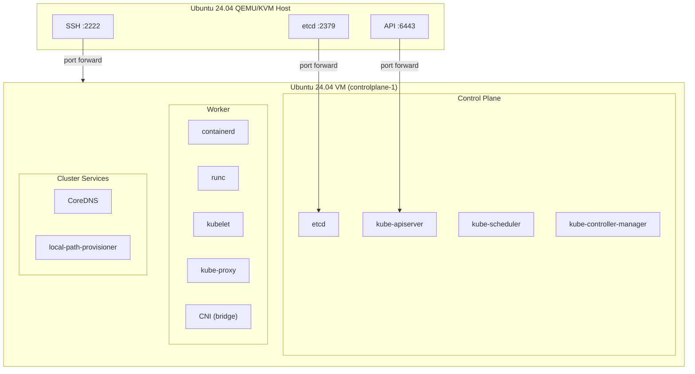

# CKA Exam Prep: Kubernetes from Scratch

This repository contains a step-by-step guide for bootstrapping a single-node Kubernetes cluster entirely from scratch, without kubeadm or any installer. Every component is installed as a raw binary and configured as a systemd service, giving full visibility into how Kubernetes works under the hood.

The guide is designed for CKA (Certified Kubernetes Administrator) exam preparation. The CKA is a performance-based exam where you work directly on live clusters, so understanding what each component does and how they connect is more valuable than memorizing commands.

## What You Will Build

A single QEMU/KVM virtual machine running Ubuntu 24.04 with all Kubernetes components installed manually:

## Prerequisites

**Hardware:**
- x86_64 CPU with hardware virtualization enabled (Intel VT-x or AMD-V)
- At least 8 GB RAM (4 GB allocated to the VM)
- 50 GB free disk space

**Host OS:**
- Ubuntu 24.04 LTS

**Prior knowledge:**
- Comfortable with the Linux command line
- Basic understanding of networking (IP addresses, ports, DNS)
- Familiarity with Kubernetes concepts (pods, services, namespaces) is helpful but not required

**Time estimate:** 2-3 hours from start to finish

## Guide Structure

The guide is split into six documents, each covering one layer of the stack. Follow them in order.

### [00 - Overview](00-overview.md)

Quick reference card with the version table, CIDR ranges, and VM access commands. Not a walkthrough, just a cheat sheet to keep open while working through the other documents.

### [01 - QEMU VM Setup](01-qemu-vm-setup.md)

Verifies the QEMU/KVM stack on the host machine and creates a headless Ubuntu VM using a cloud image and cloud-init. The VM boots with swap disabled, kernel modules loaded, sysctl parameters set, and prerequisite packages installed. Port forwarding maps SSH (2222), the Kubernetes API (6443), and other component ports from the host to the VM.

**Time:** 25-35 min. **Result:** A running VM you can SSH into at `ssh kube@127.0.0.1 -p 2222`.

### [02 - Bootstrapping Security](02-bootstrapping-security.md)

Generates a root Certificate Authority, TLS certificates for every Kubernetes component, kubeconfig files that bundle client credentials, and an encryption key for Secrets at rest. Everything is generated inside the VM using cfssl and kubectl.

**Time:** 30-40 min. **Result:** An `~/auth/` directory containing 14 PEM files, 5 kubeconfigs, and 1 encryption config.

### [03 - Control Plane](03-control-plane.md)

Installs etcd, kube-apiserver, kube-controller-manager, and kube-scheduler as systemd services. Configures them with the certificates from the previous step and starts them up.

**Time:** 35-45 min. **Result:** A functioning Kubernetes API at `https://127.0.0.1:6443` that responds to `kubectl get namespaces`.

### [04 - Container Runtime](04-container-runtime.md)

Installs containerd (container lifecycle daemon), runc (low-level container executor), and crictl (debugging CLI). Configures containerd to use systemd cgroup management.

**Time:** 10-15 min. **Result:** A container runtime ready for kubelet to use.

### [05 - Worker Components](05-worker-components.md)

Installs CNI plugins (bridge networking and loopback), kubelet, and kube-proxy. Creates RBAC rules so the API server can call back to kubelet for operations like `kubectl exec` and `kubectl logs`. Schedules a test pod to verify everything works end to end.

**Time:** 20-30 min. **Result:** The node shows as `Ready` in `kubectl get nodes` and pods can be scheduled.

### [06 - Cluster Services](06-cluster-services.md)

Installs Helm, then uses it to deploy CoreDNS for cluster-internal DNS resolution. Optionally installs local-path-provisioner for PersistentVolumeClaim support. Runs final verification tests.

**Time:** 20-30 min. **Result:** A complete single-node Kubernetes cluster with working DNS and optional storage provisioning.

## Component Versions

| Component | Version | Notes |
|-----------|---------|-------|
| Ubuntu (guest) | 24.04 LTS | Cloud image, headless |
| etcd | v3.6.9 | Latest stable patch |
| Kubernetes | v1.35.3 | CKA exam target version |
| containerd | v2.1.3 | |
| runc | v1.3.0 | |
| cri-tools | v1.35.0 | Matches Kubernetes minor version |
| CNI plugins | v1.7.1 | Bridge + loopback |

## Network Layout

| CIDR | Purpose |
|------|---------|
| `10.96.0.0/16` | Service ClusterIPs (CoreDNS gets `10.96.0.10`, API server gets `10.96.0.1`) |
| `10.244.0.0/16` | Pod IPs (allocated by the bridge CNI plugin) |
| `10.0.2.0/24` | QEMU guest network (VM gets `10.0.2.15` via DHCP) |

## What This Guide Does Not Cover

This guide intentionally focuses on the single-node bootstrap and stops there. The following topics are out of scope:

- **Multi-node clusters.** The 2-node and 3-node setups require bridge networking, per-node certificates, and etcd clustering. Those will be separate documents.
- **kubeadm.** The CKA course (Mumshad, S11) covers kubeadm-based installation. This guide is the manual counterpart for deeper understanding.
- **Ingress controllers.** Not useful with QEMU user-mode networking.
- **LoadBalancer services / MetalLB.** No shared L2 network to advertise on.
- **Production hardening.** Certificate rotation, audit logging configuration, pod security admission, and network policies are all important but separate from the bootstrap exercise.
- **Cilium or Calico.** The basic bridge CNI is sufficient for a single node. A production CNI is worth exploring when you move to multi-node.

## Source Material

The security, control plane, and worker component documents are adapted from [Kubernetes the Harder Way](https://github.com/ghik/kubernetes-the-harder-way/tree/linux) by ghik, which is itself inspired by Kelsey Hightower's [Kubernetes the Hard Way](https://github.com/kelseyhightower/kubernetes-the-hard-way). Both are excellent references if you want the full multi-node experience.

## Testing Status

- Last verified: 2026-04-27
- Platform: Ubuntu 24.04 LTS host
- Known issues: None

## Scripts Reference

| Script | Purpose | When to Use |
|--------|---------|-------------|
| `scripts/create-node.sh` | Creates the controlplane-1 VM with cloud-init configuration | Initial setup (runs document 01 commands) |
| `scripts/break-cluster.sh` | Introduces deliberate failures for troubleshooting practice | After completing the guide, when you want to practice diagnosis and repair |
