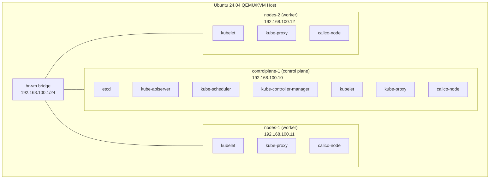

# CKA Exam Prep: Three-Node Kubernetes Cluster

This guide bootstraps a three-node Kubernetes cluster on QEMU/KVM virtual machines
using `kubeadm`: one control plane node and two workers. It is the natural next step
after the two-node guide (`two-kubeadm`) and is the right tool for practicing workload
scheduling across multiple workers, pod affinity and anti-affinity, daemon sets, and
drain-and-upgrade workflows where you need a spare worker to accept the load.

| Guide | Install Method | Nodes |
|---|---|---|
| `single-kubeadm` | kubeadm | 1 (control plane = worker) |
| `two-kubeadm` | kubeadm | 1 CP + 1 worker |
| `three-kubeadm` (this guide) | kubeadm | 1 CP + 2 workers |
| `ha-kubeadm` | kubeadm + HAProxy | 2 CP + 3 workers (HA) |

## What You Will Build

Three QEMU/KVM virtual machines on a host-side Linux bridge, running Ubuntu 24.04,
joined into a `kubeadm`-installed Kubernetes cluster:

## Prerequisites

**Hardware:**
- x86_64 CPU with hardware virtualization enabled (Intel VT-x or AMD-V)
- At least 24 GB RAM (4 GB allocated to each VM, plus host overhead)
- 150 GB free disk space

**Host OS:**
- Ubuntu 24.04 LTS

**Prior experience:**
- Completed the two-node guide, or equivalent comfort with `kubeadm` and bridge
  networking. This guide reuses the same bridge setup and kubeadm workflow but extends
  VM provisioning and the worker join step to cover two workers.

**Time estimate:** 1.5 hours from start to finish

The Ubuntu cloud image cached at `~/cka-lab/images/ubuntu-24.04-server-cloudimg-amd64.img`
from the single-node guide is reused here.

## Guide Structure

### [00 - Overview](00-overview.md)

Quick reference: hostnames, IPs, version table, CIDR ranges, common commands.

### [01 - Host Bridge Setup](01-host-bridge-setup.md)

Identical to `two-kubeadm/01-host-bridge-setup.md`. Skip if `br-vm` is already configured.

**Time:** 20-30 min. **Result:** `br-vm` interface on the host with `192.168.100.1/24`, NAT and `qemu-bridge-helper` configured.

### [02 - VM Provisioning](02-vm-provisioning.md)

Creates three headless Ubuntu 24.04 VMs (`controlplane-1`, `nodes-1`, `nodes-2`) with
cloud-init and static IPs on the bridge.

**Time:** 20-25 min. **Result:** Three VMs reachable at `ssh controlplane-1`, `ssh nodes-1`, `ssh nodes-2`.

### [03 - Node Prerequisites](03-node-prerequisites.md)

Installs containerd, runc, CNI binaries, crictl, and the `kubeadm`/`kubelet`/`kubectl`
toolchain on all three nodes.

**Time:** 10-15 min. **Result:** All three nodes have a working container runtime and `kubeadm` at v1.35.3.

### [04 - Control Plane Init](04-control-plane-init.md)

Runs `kubeadm init` on `controlplane-1`. Sets up `kubectl` access and copies the
kubeconfig to the host.

**Time:** 10-15 min. **Result:** Kubernetes API reachable at `https://192.168.100.10:6443`. `controlplane-1` is `NotReady`.

### [05 - CNI Installation](05-cni-installation.md)

Installs Calico via the Tigera operator. Removes the control plane taint so
`controlplane-1` can also schedule workloads.

**Time:** 5-10 min. **Result:** `controlplane-1` goes `Ready`, `NetworkPolicy` enforced.

### [06 - Worker Join](06-worker-join.md)

Joins `nodes-1` and `nodes-2` to the cluster using a freshly generated token. Verifies
cross-node pod scheduling and networking. Snapshots all three qcow2 disks.

**Time:** 15-20 min. **Result:** All three nodes `Ready`, pods scheduling across all nodes.

### [07 - Cluster Services](07-cluster-services.md)

Installs local-path-provisioner, Helm, metrics-server, and optionally MetalLB.

**Time:** 5-10 min. **Result:** Complete cluster ready for Day 1-14 Mumshad scenarios.

## Component Versions

| Component | Version | Notes |
|-----------|---------|-------|
| Ubuntu (guest) | 24.04 LTS | Cloud image, headless |
| Kubernetes | v1.35.3 | CKA exam target version |
| containerd | Ubuntu 24.04 apt | |
| runc | Ubuntu 24.04 apt | containerd dependency |
| cri-tools (crictl) | v1.35.0 | |
| CNI plugins (binaries) | v1.7.1 | Required by Calico |
| Calico | v3.31.0 | Tigera operator install |

## Network Layout

| CIDR | Purpose | Where It Appears |
|------|---------|------------------|
| `192.168.100.0/24` | Lab-VMs VLAN 100, bridge `br-vm` | VM IPs (`.10`, `.11`, `.12`), host bridge at `192.168.100.2`, UCG-Fiber gateway at `192.168.100.1`, MetalLB pool slice (optional) |
| `10.96.0.0/16` | Service ClusterIPs | `kubeadm` `serviceSubnet`, CoreDNS `10.96.0.10`, kubelet `clusterDNS`, API server `10.96.0.1` |
| `10.244.0.0/16` | Pod IPs | `kubeadm` `podSubnet`, Calico IPPool `cidr` |

## What This Guide Does Not Cover

- **HA control plane.** Single control plane node. See `ha-kubeadm` for stacked-etcd HA.
- **Four-or-more-node clusters.** Adding a fourth worker follows the same pattern as
  adding the second (`06-worker-join.md`) -- generate a new token and run `kubeadm join`.

## Differences from Two-Node Guide

| Concern | two-kubeadm | three-kubeadm |
|---|---|---|
| VMs | 2 (1 CP + 1 worker) | 3 (1 CP + 2 workers) |
| RAM required | 8 GB | 12 GB |
| Worker join | 1 node | 2 nodes |
| Drain practice | Limited (only one worker) | Full (drain one, workloads move to the other) |
| DaemonSet visibility | Single worker | Both workers show separate DaemonSet pods |

The scheduling difference is the key reason to add a second worker: with two workers you
can drain one and watch workloads migrate, observe pod affinity and anti-affinity rules
spread (or co-locate) pods across nodes, and see DaemonSets place one pod per worker.

## Testing Status

- Last verified: 2026-05-02
- Platform: Ubuntu 24.04 LTS host
- Known issues: None

## Scripts Reference

| Script | Purpose | When to Use |
|--------|---------|-------------|
| `scripts/break-cluster-multinode.sh` | Introduces deliberate multi-node failures for practice | After completing the guide, to practice diagnosis and repair |
