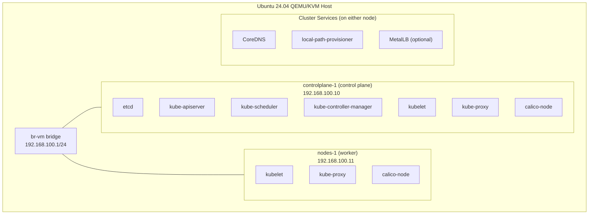

# CKA Exam Prep: Two-Node Kubernetes Cluster

This repository contains a step-by-step guide for bootstrapping a two-node Kubernetes cluster on a pair of QEMU/KVM virtual machines using `kubeadm`. It is one of four guides under `cka/vm/`:

| Guide | Install Method | Nodes |
|---|---|---|
| `cka/vm/single-systemd` | Manual binaries + systemd units | 1 |
| `cka/vm/single-kubeadm` | `kubeadm` | 1 |
| `cka/vm/two-systemd` | Manual binaries + systemd units, per-node CNI with manual host routes | 2 |
| `cka/vm/two-kubeadm` (this guide) | `kubeadm` + Calico | 2 |

The two `kubeadm` guides exist because the CKA exam runs on `kubeadm`-installed clusters and tests `kubeadm` lifecycle operations directly: cluster init, worker join, token rotation, certificate renewal, control plane upgrades, and etcd backup/restore. The two `systemd` guides exist for the educational value of seeing what `kubeadm` does under the hood.

The cluster is suitable for practicing every Day 1 through Day 14 scenario in the Mumshad CKA course: scheduling, taints and tolerations, node affinity, daemonsets, cordon and drain, control plane upgrades, kubeadm join token rotation, etcd backup and restore, multi-node networking, NetworkPolicy, and CNI troubleshooting.

## What You Will Build

Two QEMU/KVM virtual machines on a host-side Linux bridge, running Ubuntu 24.04, joined into a `kubeadm`-installed Kubernetes cluster:

Both VMs sit on the same Linux bridge with real IPs, so they can reach each other directly and you can SSH into either one from the host without port forwarding.

## Prerequisites

**Hardware:**
- x86_64 CPU with hardware virtualization enabled (Intel VT-x or AMD-V)
- At least 16 GB RAM (4 GB allocated to each VM, plus host overhead)
- 100 GB free disk space

**Host OS:**
- Ubuntu 24.04 LTS

**Prior experience:**
- Completed the single-node guide, or equivalent comfort with QEMU/KVM and cloud-init
- Working knowledge of `kubectl` and basic Kubernetes resources (Pod, Service, Deployment, ConfigMap)

**Time estimate:** 1 hour from start to finish

The Ubuntu cloud image cached at `~/cka-lab/images/ubuntu-24.04-server-cloudimg-amd64.img` from the single-node guide is reused here. If you skipped the single-node guide, the cloud image download step is included in document 02.

## Guide Structure

The guide is split into eight documents. The first three set up infrastructure that the single-node guide either covered differently or did not need. The remaining five replace the manual control plane and worker setup with their `kubeadm` equivalents.

### [00 - Overview](00-overview.md)

Quick reference card: hostnames, IPs, version table, CIDR ranges, common commands. Open this in a side window while working through the other documents.

### [01 - Host Bridge Setup](01-host-bridge-setup.md)

Configures a Linux bridge `br-vm` on the host so that both VMs share an L2 segment, get real IPs in `192.168.100.0/24`, and can be SSH'd into directly with no port forwarding. Adds NAT rules so the VMs reach the internet through the host's uplink. Replaces the QEMU user-mode networking from the single-node guide.

**Time:** 20-30 min. **Result:** A `br-vm` interface on the host with `192.168.100.1/24`, NAT in place for outbound traffic, and `qemu-bridge-helper` configured to attach VMs.

### [02 - VM Provisioning](02-vm-provisioning.md)

Creates two headless Ubuntu 24.04 VMs (`controlplane-1` and `nodes-1`) with cloud-init, attached to `br-vm` with static IPs. Generates per-VM start and stop scripts and cluster-level scripts that operate on both nodes at once. The cloud-init config disables swap, loads kernel modules, and sets sysctls for both nodes.

**Time:** 15-20 min. **Result:** Two VMs reachable at `ssh controlplane-1` and `ssh nodes-1`, each with `kubeadm` prerequisites already met.

### [03 - Node Prerequisites](03-node-prerequisites.md)

Installs containerd and crictl via apt, the CNI plugin binaries from the upstream release, and the `kubeadm`, `kubelet`, `kubectl` tools on both nodes. Configures containerd for systemd cgroup management. Pins package versions so a routine `apt upgrade` does not silently bump the cluster mid-lab. This document is identical for both nodes.

**Time:** 10-15 min. **Result:** Both nodes have a working container runtime and the `kubeadm` toolchain at v1.35.3.

### [04 - Control Plane Init](04-control-plane-init.md)

Runs `kubeadm init` on `controlplane-1` with a YAML config (not flags), sets up `kubectl` access, and copies the kubeconfig to the host. Includes a mapping table from each `kubeadm`-generated file back to its hand-rolled equivalent in the single-node guide.

**Time:** 10-15 min. **Result:** A functioning Kubernetes API at `https://192.168.100.10:6443`. `controlplane-1` is `NotReady` because there is no CNI yet.

### [05 - CNI Installation](05-cni-installation.md)

Installs Calico via the Tigera operator with a custom `Installation` resource that aligns the IPPool CIDR with the `kubeadm` `podSubnet`. Removes the control plane `NoSchedule` taint so workloads can run on `controlplane-1`. Verifies `NetworkPolicy` enforcement, since Flannel silently ignoring `NetworkPolicy` is the most common CKA exam CNI gotcha.

**Time:** 5-10 min. **Result:** `controlplane-1` goes `Ready`, pods get IPs from `10.244.0.0/16`, and `NetworkPolicy` is enforced.

### [06 - Worker Join](06-worker-join.md)

Joins `nodes-1` to the cluster with a freshly generated `kubeadm token`, verifies cross-node pod-to-pod traffic across the Calico VXLAN tunnel, and snapshots both qcow2 disks so you can roll back to clean-install state after deliberately breaking things.

**Time:** 10-15 min. **Result:** Both nodes `Ready`, pods scheduling on both, cross-node Service resolution working.

### [07 - Cluster Services](07-cluster-services.md)

Installs the same set of services as the single-node `06-cluster-services.md`, adapted for two nodes: `local-path-provisioner` for PVCs, Helm, `metrics-server` (with the lab-only `--kubelet-insecure-tls` flag) for HPA scenarios. Optionally MetalLB so `LoadBalancer` services get IPs from a slice of the bridge subnet.

**Time:** 5-10 min. **Result:** A complete cluster ready for every Day 1 through Day 14 scenario in the Mumshad course.

## Component Versions

| Component | Version | Notes |
|-----------|---------|-------|
| Ubuntu (guest) | 24.04 LTS | Cloud image, headless |
| Kubernetes | v1.35.3 | CKA exam target version, installed via `kubeadm` |
| containerd | Ubuntu 24.04 apt | |
| runc | Ubuntu 24.04 apt | containerd dependency |
| cri-tools (crictl) | v1.35.0 | |
| CNI plugins (binaries) | v1.7.1 | Required by Calico |
| Calico | v3.31.0 | Tigera operator install |

## Network Layout

| CIDR | Purpose | Where It Appears |
|------|---------|------------------|
| `192.168.100.0/24` | Lab-VMs VLAN 100, bridge `br-vm` | VM IPs (`.10`, `.11`), host bridge at `192.168.100.2`, UCG-Fiber gateway at `192.168.100.1`, MetalLB pool slice (optional) |
| `10.96.0.0/16` | Service ClusterIPs | `kubeadm` `serviceSubnet`, CoreDNS `10.96.0.10`, API server `10.96.0.1` |
| `10.244.0.0/16` | Pod IPs | `kubeadm` `podSubnet`, Calico IPPool `cidr` |

The bridge subnet `192.168.100.0/24` matches what libvirt's default network uses. If you already run libvirt VMs on `virbr-vm`, the host bridge setup in document 01 includes a check and a path to reuse `virbr-vm` instead of building `br-vm` from scratch.

## What This Guide Does Not Cover

The following topics are intentionally out of scope:

- **Three-or-more-node clusters.** With two nodes you can already exercise every CKA exam scenario. A third node is genuinely useful only for HA control plane practice, which is its own document.
- **HA control plane.** This guide installs a single control plane node. The `controlPlaneEndpoint` in the `kubeadm` config is set so that the cluster could grow to HA later, but the actual stacked-etcd HA setup is a separate exercise.
- **Ingress controller install.** The exam tests Ingress YAML, not nginx-ingress installation specifics. Mumshad covers `ingress-nginx` install in S9 if you want to practice it; the path on this cluster is straight `helm install`.
- **BGP-mode Calico.** VXLAN is what the operator picks by default and what the lab uses. BGP mode requires router configuration on the host bridge and is not relevant to the exam.
- **Production hardening.** Certificate rotation policies, audit logging, pod security admission, etcd encryption at rest, and resource quotas are all important, but separate from a bootstrap exercise.

## Differences from the Single-Node Guide

| Concern | Single-node | Two-node |
|---|---|---|
| Install method | Manual (binaries + systemd units) | `kubeadm` |
| Networking | QEMU user-mode, port forwarding | Bridge + TAP, real L2 |
| CNI | Custom `bridge` plugin in `/etc/cni/net.d/` | Calico (with the same plugin binaries underneath) |
| Certificates | Hand-generated with cfssl | `kubeadm`-generated, rotated by `kubeadm certs renew` |
| Failure modes practiced | Static binary misconfig | `kubeadm join`, certificate SANs, multi-node networking, drain, upgrade |

The single-node guide is the right tool for understanding what `kubeadm` does under the hood. This guide is the right tool for exam-style cluster operations work. They complement each other rather than overlap.

## Source Material

This guide is original work, but borrows structure and conventions from the single-node guide, which itself adapts content from [Kubernetes the Harder Way](https://github.com/ghik/kubernetes-the-harder-way/tree/linux) by ghik (inspired by Kelsey Hightower's [Kubernetes the Hard Way](https://github.com/kelseyhightower/kubernetes-the-hard-way)). The `kubeadm` configuration and Calico install steps are based on the upstream Kubernetes documentation at [kubernetes.io](https://kubernetes.io/docs/setup/production-environment/tools/kubeadm/) and the Tigera operator install guide.

## Testing Status

- Last verified: 2026-04-27
- Platform: Ubuntu 24.04 LTS host
- Known issues: None

## Scripts Reference

| Script | Purpose | When to Use |
|--------|---------|-------------|
| `break-cluster-multinode.sh` | Introduces deliberate multi-node failures for troubleshooting practice | After completing the guide, when you want to practice diagnosis and repair in a multi-node context |
