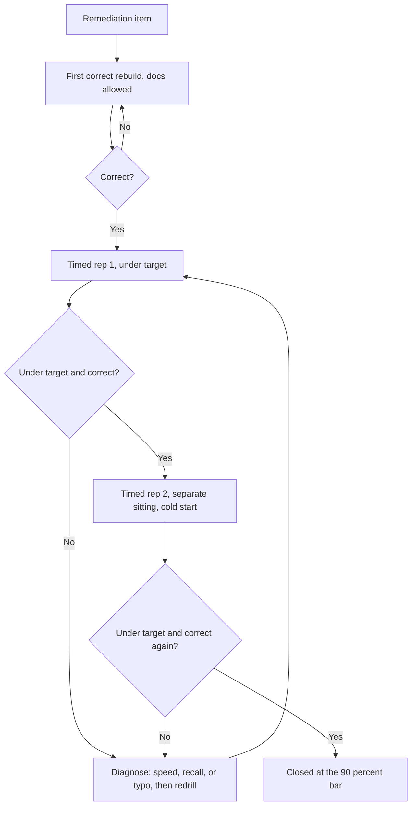

# CKA Killer.sh Simulator A: Remediation Plan
 
**Source score:** 53/74 subtasks (High Score)
**Date of attempt:** 2026-06-20 (per score export, "Last updated 1 hour ago | 2026-06-20")
**Revised:** 2026-06-21, recalibrated from a "comfortably pass" target to a 90%+ mastery target. The prior 2026-06-20 revision (correcting the skip categorization for Questions 13, 15, 16 and flagging the Q12 and Q17 score discrepancies) is retained and carried forward below.
**Target:** at least 90% on the real CKA exam, well above the 66% passing bar. Remediation is held to that higher bar throughout. A fix counts as done when it is fast and repeatable under time pressure, not when it works once.
**Companion documents:** `killer-sh-cka-simulator-a-solutions.md` (official solution transcription), `cka-simulator-a-my-submitted-solutions.md` (actual submitted answers, authoritative over score-feedback text when the two disagree), the per-day worksheets `cka-day-0.md` through `cka-day-9.md` (the day-by-day schedule that operationalizes this plan through exam day).
 
This plan follows the diagnostic gap categorization approach: each miss is sorted into a coverage gap (topic never properly learned), a retention issue (studied but couldn't recall under pressure), a speed issue (knew it, ran out of time), or **not attempted** (skipped due to low confidence under time pressure). Remediation steps are ordered by severity.
 
At a comfortable-pass target, a retention issue could be marked closed the first time it was fixed cleanly. At a 90%+ target that is not sufficient. The bar for every item below is reliability under time pressure across multiple repetitions, not a single correct rebuild. A topic that can be done correctly once but slowly, or correctly only when unhurried, is not closed. Throughout this plan, "fixed" means two clean consecutive timed reps under the stated speed target, ideally on separate sittings where the schedule allows, so that the fix is shown to survive a cold start rather than benefiting from having just been studied. The consolidated speed-target table near the end is the closure checklist.
 
**Revision note (carried forward from 2026-06-20):** the original version of this plan categorized Questions 13, 15, and 16 as "coverage gaps" implying a failed attempt with an incorrect mental model. Reviewing the actual submission history showed all three were skipped outright, no attempt was made. This is a meaningfully different diagnostic signal than a wrong attempt, and the categorization below reflects the correction. Question 12 and Question 17 also had their stated failure reasons checked against the actual submitted YAML; both showed discrepancies that are flagged as unresolved rather than asserted as fact, and the new "What a 90%+ Target Requires" section below treats driving those two to a definite answer as mandatory rather than optional.
 
---
 
## Score Summary by Question
 
| Question | Topic | Score | Category |
|---|---|---|---|
| 13 | Gateway API / HTTPRoute | 0/5 | **Not attempted** (skipped) |
| 15 | NetworkPolicy with StatefulSets | 0/7 | **Not attempted** (skipped) |
| 16 | CoreDNS custom domain | 0/3 | **Not attempted** (skipped) |
| 12 | topologySpreadConstraints / anti-affinity | 8/11 | Retention issue (reason disputed, see below) |
| 6 | PersistentVolume hostPath | 5/6 | Retention issue (typo-class, confirmed) |
| 5 | Kustomize HPA + manual cleanup | 5/6 | Retention issue (procedural step, confirmed) |
| 17 | crictl labels | 5/6 or 6/6 | Retention issue (typo-class, score disputed, see below) |
| 1, 2, 3, 4, 7, 8, 9, 10, 11, 14 | various | full marks | Re-examined for speed and robustness (see "Full-Mark Questions Re-Examined") |
 
---
 
## Priority 1: Not Attempted (Zero Scores)
 
These three topics scored zero across the board, but the actual submission history confirms this was because **no attempt was made**, not because an attempt was made with an incorrect mental model. The reasoning given for skipping all three: low confidence in the correct approach, and attempting them would have required looking up reference documentation and spending several minutes on a question with uncertain payoff, time better spent on questions with a clearer path to points. That's a reasonable exam-time triage decision. The cost is that these three topics remain **completely unverified**, there's no data showing whether the AND/OR structural trap below would actually have been hit in practice, only that the underlying procedure wasn't confidently known well enough to attempt under time pressure.
 
Each gets full remediation, treated as **first-pass learning**, not as correcting a wrong mental model: read the concept, build the solution from scratch without looking at the official solution doc first, then check against it. Because the original failure was the attempt decision itself, the closure bar for these three is stricter than for the partials: an item is closed only when it can be attempted and completed under its speed target on a cold start, twice, since a correct unhurried rebuild in isolation does not prove the skip decision changes when the clock is running.
 
### Gap 1: Gateway API / HTTPRoute (Question 13)
 
**What happened:** Skipped, no attempt submitted. Score of 0/5 reflects the absence of an HTTPRoute resource entirely, not a structurally incorrect one.
 
**The specific trap to internalize for the redo:** within a single `matches` list item, `path:` and `headers:` are ANDed together (both must match for that rule to apply). Giving `headers` its own list-item dash turns it into a second, independent match condition, which becomes an OR relationship instead. This produces a working-looking HTTPRoute that silently fails specific routing logic checks, worth deliberately triggering this mistake once during the redo so it's recognizable, not just read about.
 
**Remediation steps:**
1. Re-read the Gateway API conceptual docs at gateway-api.sigs.k8s.io (allowed exam resource), specifically the HTTPRoute reference for `rules[].matches[]`.
2. Without looking at the solution doc, write an HTTPRoute from scratch that converts a basic two-path Ingress.
3. Add a third path with a header-based condition (mimic the User-Agent routing from Q13), deliberately testing both the correct AND structure and the incorrect OR structure on a scratch cluster, to see the behavioral difference firsthand.
4. Compare against the solution doc's Question 13 section.
5. Re-run the verification curls with different header values to confirm rule order and AND logic both behave as expected.
**Speed target:** under 10 minutes end to end, including at most one lookup of the HTTPRoute schema at gateway-api.sigs.k8s.io. The 5-point weight does not justify more than that; if it runs longer, the schema is not yet internalized. Closed when two clean consecutive timed reps land under 10 minutes, ideally on separate sittings.
 
**Recheck after KodeKloud Gateway API lab** (S9, lecture 238-240). This was covered in the course, but evidently not retained with enough confidence to attempt under exam pressure. The redo on Killer.sh Session 2 is the real test: an attempt (even imperfect) indicates the confidence gap closed; a repeat skip indicates it didn't.
 
### Gap 2: NetworkPolicy with StatefulSets (Question 15)
 
**What happened:** Skipped, no attempt submitted. Score of 0/7 reflects the absence of the NetworkPolicy and no engagement with the StatefulSet readiness checks bundled into the question, not an incorrect policy or broken StatefulSets.
 
**The specific trap to internalize for the redo:** the same AND/OR structural issue as the Gateway API trap above, but in egress rule shape. A single rule with multiple `to` entries and multiple `ports` entries produces an OR/OR cross-product (any destination matches with any port), not the intended pairing. Each distinct (destination, port) pairing needs its own separate rule in the `egress` list.
 
**Remediation steps:**
1. Re-read kubernetes.io/docs NetworkPolicy reference, specifically how multiple entries within one rule's `to` and `ports` combine versus multiple separate rules.
2. Recreate the db1/db2/vault three-destination scenario from scratch on a lab cluster. Write the policy using the wrong (single-rule, multi-entry) shape first and deliberately verify with curl that it over-permits, then rewrite with the correct (separate-rule) shape and reverify all three connectivity cases.
3. Also build comfort with the StatefulSet side of this question independently, confirming `describe sts`, PVC binding, and readiness probes are second-nature checks, so a future version of this question doesn't get skipped due to uncertainty about a different part of the stack.
4. Compare against the solution doc's Question 15 section.
**Speed target:** under 12 minutes total, roughly 10 for the multi-rule egress policy and 2 for the StatefulSet readiness verification. Once drilled, the separate-rule egress shape must be written correctly on the first pass without the over-permissive single-rule detour; the detour is a learning device, not a step in the exam-time procedure. Closed when two clean consecutive timed reps land under 12 minutes.
 
**Recheck after KodeKloud Network Policy lab** (S7, lecture 179-182). Same situation as Gateway API, this is core CKA networking weight, worth building enough confidence to attempt under time pressure, not just to understand in the abstract.
 
### Gap 3: CoreDNS Custom Domain (Question 16)
 
**What happened:** Skipped, no attempt submitted. Score of 0/3 reflects no backup file written and no ConfigMap edit attempted, not an incorrect edit or a failed restart.
 
**Remediation steps:**
1. Re-read kubernetes.io/docs Customizing DNS Service page.
2. From scratch, locate the CoreDNS ConfigMap, write a backup to a file, then edit the Corefile to add a second domain alongside `cluster.local` on the same `kubernetes` plugin line (not a separate block).
3. Restart the CoreDNS Deployment with `rollout restart` and confirm both replicas come back without crash-looping (a syntax error in the Corefile will surface here).
4. Test resolution with a busybox Pod against both domains.
5. Deliberately practice the recovery path too: `kubectl diff` and `kubectl apply` against the backup file, then restart again, since "you should be able to fast recover from the backup" was an explicit requirement in the question, not just a nice-to-have.
6. Compare against the solution doc's Question 16 section.
**Speed target:** under 7 minutes, backup through resolution verification, including the recovery-from-backup path. This is the most procedural of the three skipped topics and should become the fastest of them. Closed when two clean consecutive timed reps land under 7 minutes.
 
**Recheck after KodeKloud CoreDNS lab** (S9, lecture 227-230). This one is the most procedural of the three (no AND/OR trap involved), so it's likely the fastest to build confidence in and should be attemptable on the next pass even under time pressure.
 
---
 
## Priority 2: Retention Issues (Partial Scores)
 
These four were not conceptual failures, the core approach was right but one specific element was missed under exam conditions. Treat these as "redo the lab, then specifically target the missed element," not full re-study. At the 90%+ target, "the approach was right" is not the closure condition; the closure condition is that the missed element no longer recurs across repeated timed reps, which is why Q12 and Q17 carry explicit speed targets below and why Q5 and Q6 carry mandatory verification steps rather than awareness reminders.
 
### Issue 1: topologySpreadConstraints / Anti-Affinity (Question 12, 8/11)
 
**What went wrong:** Replica count and node-spread checks failed (`readyReplicas: 3` instead of 2, all three Pods on one node instead of spread across two). The original score feedback attributed this to a missing `labelSelector.matchLabels` field. **This is disputed:** the actual submitted YAML (see `cka-simulator-a-my-submitted-solutions.md`) already includes `labelSelector.matchLabels: id: very-important`, and the constraint logic otherwise looks structurally correct for producing the expected split.
 
**Working theory pending confirmation:** the constraint may not have been in effect at the time the Deployment was first created and scheduled. If the `topologySpreadConstraints` block was added in a later edit/reapply rather than present at the original `create`, Kubernetes would not retroactively reschedule already-running Pods to satisfy a constraint added after the fact, this would produce exactly the observed symptom despite the YAML looking correct in review. Not yet confirmed.
 
**Remediation steps:**
1. On the redo, create the Deployment with the `topologySpreadConstraints` block present from the very first `apply`/`create`, not added afterward, to test whether ordering was actually the issue.
2. Separately, build the `podAntiAffinity` version from scratch as well (not used on this attempt), to build fluency in both approaches since the exam could phrase the requirement either way.
3. Practice reading the `kubectl describe pod` failure reason output (`didn't match pod anti-affinity rules` vs `didn't match pod topology spread constraints`) to diagnose which mechanism is active just from the event log.
4. If the redo with constraints-present-at-creation still fails to produce the 2-running/1-pending split, treat the `labelSelector` explanation as confirmed after all and double check it's correctly scoped.
**Speed target:** under 8 minutes including the post-create verification, which means `kubectl get pod -o wide` to confirm the 2-running/1-pending split with one Pod per worker node, plus a `describe pod` read of the unschedulable Pod's event reason. The 11-point weight (the single highest on the simulator) justifies spending the verification time rather than skipping it. Closed when two clean consecutive timed reps land under 8 minutes with the constraint present from the first apply both times, and with the root cause definitively resolved per the "What a 90%+ Target Requires" section.
 
### Issue 2: PersistentVolume hostPath Typo (Question 6, 5/6)
 
**What went wrong:** Confirmed via submission review: `hostPath.path` was written as `/Volumes/data` (lowercase d) instead of the required `/Volumes/Data` (capital D). Pure transcription error, not a conceptual gap.
 
**Remediation steps:**
1. No re-study needed. This is a verification gap, not a knowledge gap, and at the 90%+ target the fix is mechanical rather than attentional. Every task that hard-codes an exact string (a path, a name, a label key or value) ends with an explicit character-by-character read-back of that string against the question text before moving on. This is a step added to the procedure, not a reminder to be careful, because reminders do not survive time pressure and procedure steps do.
2. If this type of typo recurs across multiple questions on Session 2, treat it as a pattern, but do not wait for recurrence to install the read-back step; install it now and apply it on every exact-string task.
### Issue 3: Kustomize Manual ConfigMap Cleanup (Question 5, 5/6)
 
**What went wrong:** Confirmed via submission review: the HPA was created correctly via `kubectl autoscale --dry-run=client` and the Kustomize build was clean, but the old ConfigMap wasn't deleted from the live cluster. This is a "Kustomize doesn't track state" knowledge gap, removing a resource from the YAML source does not remove it from the cluster, since Kustomize never recorded that it created it in the first place.
 
**Remediation steps:**
1. Re-read the solution doc's explanation of why this manual step is required (Kustomize has no state, unlike Helm).
2. Build a mental checklist for any future "remove X from the YAML" task: after the apply step, explicitly check whether the removed resource still exists live (`kubectl get <kind>`), and delete manually if so. This applies any time Kustomize (not Helm) is the deployment mechanism.
3. Treat this as a flagged-question habit in the real exam: tasks that say "remove" rather than just "add" or "change" are a signal to verify cleanup actually happened, not just that the build succeeded. At the 90%+ target this verification is mandatory on every removal task, not a habit to remember when convenient.
### Issue 4: Pod Labels via crictl Question (Question 17, 5/6 or 6/6, disputed)
 
**What went wrong:** The original score feedback stated the Pod was missing the `pod: container` label, only `container: pod` and an extra `run: tigers-reunite` label were present (5/6). On review, the submitted answer was stated as 6/6, contradicting the original score record. **This is unresolved**, the actual live label set on the Pod (`kubectl get pod tigers-reunite -n project-tiger --show-labels`) would settle it if still accessible, but wasn't checked at review time.
 
**Remediation steps:**
1. Treat this as a verification habit gap regardless of which score is correct: after creating a Pod with multiple required labels (whether via `kubectl run --labels` or a `--dry-run=client` template with labels added manually), immediately run `kubectl get pod <name> --show-labels` to confirm both labels landed exactly as specified before moving to the next part of the task.
2. Watch for two distinct failure modes that both produce a missing label: a `--labels` flag with a dropped comma-separated pair, or a manual YAML edit where one of two required labels under `metadata.labels` gets added but the other is missed.
3. Resolve the score discrepancy directly per the "What a 90%+ Target Requires" section: at this target it is not acceptable to leave it as "5/6 or 6/6, unresolved." Either check the live cluster state or score breakdown to settle it, or, if the environment is no longer accessible, treat the `--show-labels` verification step as mandatory rather than conditional so the failure mode cannot recur regardless of which score was correct.
**Speed target:** under 8 minutes including the node hop, the `crictl inspect`, and the `--show-labels` verification of the Pod labels. The label creation and verification itself should take under a minute; the rest is the crictl walk (SSH to the node, `sudo -i`, `crictl ps -a`, `crictl inspect <id>`, extract container ID and runtime type, capture logs). Closed when two clean consecutive timed reps land under 8 minutes.
 
---
 
## Full-Mark Questions Re-Examined
 
These ten questions scored full marks on Simulator A and were previously logged as "no action needed." At a comfortably-pass target that was correct. At a 90%+ target it is not, for two reasons. First, full marks on one Killer.sh attempt does not establish that the same approach is fast, or that it would survive a reworded version of the same task on the real exam; a solution can be correct and still be slow, dependent on an environment-specific assumption, or built on a shortcut that breaks under a small phrasing change. Second, the time these questions take directly determines how much of the two hours is left for the harder ones, so a correct-but-slow habit on an easy question is a real cost at this target. The review below reads each full-mark question's actual submission (see `cka-simulator-a-my-submitted-solutions.md`) and flags the ones that deserve a speed or robustness pass. Several are genuinely clean and are marked as such rather than manufacturing a problem.
 
### Q1, Cluster Access (full marks): minor robustness
 
The submission pulled the client certificate with `kubectl config view --raw -o jsonpath="{.users[0].user.client-certificate-data}"` and listed contexts with `{.contexts[*].name}`. Both worked, but `.users[0]` assumes the target user is the first entry in the kubeconfig. On a kubeconfig with multiple users a different index could be required, and the robust form selects the user tied to the current context by name rather than by position. This is a low-probability robustness gap, not a speed issue; the question is already fast. **Pass:** practice pulling the cert for the current-context user by name once, so the index assumption becomes a deliberate shortcut rather than the only path known. No speed target needed.
 
### Q4, Pod QoS / Eviction (full marks): robustness and generalization
 
The submission found the first-to-be-evicted Pods by filtering custom-columns output for `<none>` resource requests, which identifies BestEffort Pods (evicted first under node-pressure). It worked because the question asked for the first-evicted set. The generalizable skill is the QoS-class-to-eviction-order mapping (BestEffort first, then Burstable ordered by how far each is over its requests, then Guaranteed last), not the grep-for-`none` shortcut. A reworded version (find the Pods evicted last, or find the Burstable Pods) would not be answerable with the same filter. **Pass:** practice classifying a namespace's Pods into all three QoS classes from their requests and limits, and answer both the "first evicted" and "last evicted" framings, so the approach survives a rephrasing. **Speed target:** under 5 minutes for the classification and selection.
 
### Q8, Version Upgrade and Join (full marks): speed and procedural reliability
 
This scored full marks, but the submission notes that only the initial `dpkg` inspection line was captured; the apt version-pin, token creation, and `kubeadm join` steps were executed correctly but not recorded. At a 90%+ target this is the full-mark question most worth hardening, precisely because it is multi-step and procedural. The apt version-pinning sequence (`apt-mark unhold`, install the exact package version string including its build suffix, `apt-mark hold`) is fiddly, easy to fumble under time pressure, and exactly where minutes leak. "It was executed correctly per the score" but not documented means it cannot be reviewed for speed or for a missed step. **Pass:** run the full sequence end to end on a scratch kubeadm environment (the QEMU/KVM single-node build or an equivalent throwaway, not the Pi cluster, which stays off-limits until after the exam), record it verbatim into the submitted-solutions record so it can actually be reviewed, and drill it until the apt step is muscle memory rather than a per-attempt lookup. **Speed target:** under 12 to 15 minutes for the full upgrade-and-join with no fumbling on the package version syntax.
 
### Q9, API from Inside a Pod (full marks): robustness, environment assumption
 
The submission used the literal kubernetes Service ClusterIP `10.96.0.1:443` directly instead of the `kubernetes.default` DNS name, and `--cacert ca.crt` instead of `-k`. The `--cacert` choice is good and robust. The hardcoded `10.96.0.1` is the robustness flag: it is the first address of the default service CIDR (10.96.0.0/12), so it works on any cluster using the default range but silently breaks on a cluster with a different service CIDR. The portable form is `https://kubernetes.default` (or the full `kubernetes.default.svc`). **Pass:** rebuild this using the DNS name rather than the hardcoded IP so the portable form is the default reflex. Consistent with the established note that `nslookup kubernetes.default` is unreliable in minimal images, verify reachability with the curl HTTP-code check (`curl -sk -o /dev/null -w "%{http_code}" https://kubernetes.default`) rather than with nslookup. **Speed target:** under 5 minutes for the Pod plus the in-Pod API call.
 
### Q10, Service Accounts / RBAC (full marks): speed
 
The three RBAC resources (ServiceAccount, Role, RoleBinding) were hand-written as full YAML and verified with `kubectl auth can-i ... --as=system:serviceaccount:...`, which is the correct verification and should be kept. The hand-writing is the speed flag: the imperative generators produce the same result far faster, and the RoleBinding subjects block (the slowest part to hand-write correctly) is the part the generator helps with most. **Pass:** switch to `kubectl create serviceaccount processor -n project-hamster`, `kubectl create role processor --verb=create --resource=configmaps,secrets -n project-hamster --dry-run=client -o yaml`, and `kubectl create rolebinding processor --role=processor --serviceaccount=project-hamster:processor -n project-hamster --dry-run=client -o yaml`, piping to a file only if an edit is needed, and keep the `auth can-i --as=` verification. **Speed target:** under 4 minutes for all three resources plus verification.
 
### Q11, DaemonSet (full marks): minor speed
 
The DaemonSet was hand-written and correctly carried two tolerations (control-plane and the legacy master key), which is robust and worth keeping. There is no `kubectl create daemonset` generator, so the only speed lever is scaffolding: generate a Deployment with `kubectl create deployment --dry-run=client -o yaml`, then change `kind` to DaemonSet and drop `replicas`, `strategy`, and the `status` block, rather than typing the full template from scratch. Minor. **Pass:** practice the Deployment-to-DaemonSet scaffold once so it is the default reflex. **Speed target:** under 5 minutes.
 
### Q14, Cert Management (full marks): subtle correctness and robustness
 
The cert expiry was read with `openssl x509 -in ... -noout -enddate`, which is the correct, direct flag, and the renew command was written to the script file correctly. The robustness flag is the redirect in the submitted command, `... -enddate 2>&1 > /opt/course/14/expiration`. The submission note states this captures stderr alongside stdout into the file. It does not. Shell redirections are applied left to right, so `2>&1` points stderr at wherever stdout currently goes (the terminal) before `> file` redirects stdout to the file; the result is stdout in the file and stderr still on the terminal. It passed only because openssl emitted nothing on stderr for a valid cert. The order that actually does what the note intended is `> file 2>&1`. This is exactly the kind of detail that scores full marks here but would not generalize to a command that does write to stderr. **Pass:** internalize `> file 2>&1` as the capture-both order, and more generally read redirect order deliberately rather than assuming `2>&1` "adds stderr" regardless of its position. No speed target; the question is already fast.
 
### Q2, Q3, Q7: clean or near-clean
 
Q3 (scale a StatefulSet) and Q7 (kubectl top scripts) were trivial, fast, and fully general; no action. Q2 (cert-manager via Helm) was correct and efficient; the only minor note is that `helm install -h` was consulted for syntax, so the `helm install <release> <chart> -n <ns> --set k=v` form is worth having cold to save the lookup, and the CRD flag name depends on the chart version (`crds.enabled=true` on current cert-manager charts, `installCRDs=true` on older ones), so knowing both avoids a failed install on whatever version the exam ships. Not a speed target, just a small awareness note.
 
---
 
## What a 90%+ Target Requires Beyond Closing the Known Gaps
 
This is the substantive recalibration. Closing the three skips and the two disputed items would, on its own, plausibly move the Killer.sh score from the low 70s into passing-comfortably territory, which was the old target. Reaching 90% on the real exam is a different problem, and three things matter at that bar that did not need to at the lower one.
 
**Consistency across repeated attempts.** A single correct rebuild of a previously-missed topic is necessary but not sufficient evidence. The real exam is one cold attempt with no warm-up on the specific task, so the relevant question is not "can I do this right after studying it" but "can I do this right on a cold start, twice, under the time target." Every remediation item above carries a two-clean-consecutive-reps bar for this reason. The consolidated speed-target table below is the checklist; an item is not closed until both reps land under target, and the cold-start re-verification on Day 8 of the pre-exam plan exists to confirm the fixes survive a multi-day gap rather than only working on the day they were drilled.
 
**Eliminating the typo-class mistakes entirely, not just building awareness of them.** Question 6 lost a point to `/Volumes/data` versus `/Volumes/Data`, and Question 17's dispute hinges on whether one of two required labels was dropped in a manual edit. At a comfortable-pass target these are minor and the remediation was "build awareness, re-read exact strings." At a 90%+ target that framing is too soft, because a single dropped character or missed label is the difference between a question scoring full marks and scoring partial, and a 90% target has almost no room for partial-credit leakage. The fix is mechanical, not attentional: every task that hard-codes an exact string (a path, a name, a label key or value) ends with an explicit read-back of that string against the question text before moving on, and every multi-label or multi-field resource ends with a `kubectl get ... --show-labels` or `kubectl get ... -o yaml` confirmation that each required field landed exactly. This is a verification step added to the procedure, not a reminder to be careful, because reminders do not survive time pressure and procedure steps do.
 
**Treating the disputed and unresolved items as fully resolved, not as acceptable ambiguity.** Q12's root cause (the disputed labelSelector claim versus the constraint-added-after-creation theory) and Q17's score (5/6 versus 6/6, hinging on the live label set) are currently logged as open. At a comfortable-pass target, two unresolved points out of seventy-four did not matter. At a 90%+ target they do, both because the points themselves now sit inside the margin that separates 85 from 90, and because an unresolved root cause means the underlying skill is not actually verified, only assumed. Both must be driven to a definite answer rather than left as a flagged ambiguity. For Q12, the Session 2 redo with the constraint present from the first apply either reproduces the correct split, confirming the ordering theory and closing it, or it does not, confirming the labelSelector explanation and closing it the other way; either outcome is acceptable, an unresolved "probably one or the other" is not. For Q17, that means checking the actual label set if the environment is still accessible, or, if it is not, treating the verification-habit fix as mandatory rather than conditional, so the failure mode cannot recur regardless of which score was correct.
 
**On the diagnostic categories.** The four categories (not attempted, coverage gap, retention issue, speed issue) are retained, because the sorting still drives the remediation path. What changes at this target is the closure bar within each category. "Retention issue, fixed once" is no longer a closed state. A retention issue is closed when the topic is reliable under time pressure across multiple repetitions, which is the two-clean-consecutive-reps bar applied per item. A speed issue is closed when the target time is hit twice consecutively, not when it is hit once on a good run. A not-attempted item is closed only when it is attempted and completed under target on Session 2 or in drills, since the original failure was the attempt decision itself, and a correct unhurried rebuild in isolation does not prove that decision changes under the clock.
 
---
 
## Consolidated Speed Targets
 
These are realistic cold-start targets under exam conditions, derived from each question's point weight and step count. They are goals to drill toward, not official figures, and the qualitative closure condition in the final column matters as much as the clock. An item is closed only when the target is met twice consecutively, ideally on separate sittings.
 
The closure gate that every row in the table below has to pass, with the "cold start, twice" standard made explicit:
 

 
| Question | Topic | Weight | Target (cold, under exam conditions) | Closed when |
|---|---|---|---|---|
| Q12 | topologySpread / anti-affinity | 11 | under 8 min incl. verification | 2 consecutive reps under target, constraint present from first apply, root cause resolved |
| Q15 | NetworkPolicy + StatefulSet checks | 7 | under 12 min (approx 10 policy + 2 STS) | 2 consecutive reps under target, separate-rule egress on first pass |
| Q17 | crictl labels + inspect | 6 | under 8 min incl. `--show-labels` | 2 consecutive reps under target, score dispute resolved |
| Q13 | Gateway API / HTTPRoute | 5 | under 10 min, at most 1 schema lookup | 2 consecutive reps under target |
| Q16 | CoreDNS custom domain | 3 | under 7 min incl. recovery path | 2 consecutive reps under target |
| Q10 | ServiceAccount / RBAC | full | under 4 min via generators | generator path is the default reflex |
| Q4 | Pod QoS / eviction | full | under 5 min via QoS classification | answers both "first" and "last" framings |
| Q9 | API from inside Pod | full | under 5 min via DNS name | `kubernetes.default` used, not the hardcoded IP |
| Q11 | DaemonSet | full | under 5 min via Deployment scaffold | scaffold path is the default reflex |
| Q8 | version upgrade + join | full | under 12 to 15 min, no apt fumbling | full sequence recorded and drilled to muscle memory |
| Q14 | cert check + renew | full | already fast | `> file 2>&1` capture order internalized |
| Q1 | kubeconfig access | full | already fast | current-context user selection practiced once |
 
---
 
## Suggested Sequencing
 
Given this plan slots into the existing Killer.sh remediation window (course-completion, then Session 1, then remediation, then Session 2), a reasonable order is:
 
1. **Skipped questions first** (Gateway API, NetworkPolicy, CoreDNS), these need the most time since they're first-pass learning rather than corrections, and are the highest-risk items if left unaddressed: a repeat skip on Session 2 means the confidence gap didn't close, which is worse signal than a wrong-but-attempted answer would be. Each carries a stricter closure bar (attempted and under target on a cold start, twice) because the original failure was the attempt decision itself.
2. **Disputed and retention issues next** (topology spread root cause, Kustomize cleanup habit, the two typo-class fixes), with Q12 specifically redone with the constraint present from initial creation to settle the ordering theory, and Q17's score driven to a definite answer rather than left disputed.
3. **Full-mark speed and robustness passes** (Q4 QoS classification, Q8 kubeadm sequence recorded and drilled, Q9 portable DNS name, Q10 RBAC generators, Q14 redirect order, plus the minor Q1 and Q11 passes). These are quick to install since the underlying topics are already understood; the work is changing the default reflex and recording what was never written down, not relearning.
4. **Typo-class verification steps** carried into every relevant question, not treated as a one-time fix. The read-back of exact strings and the `--show-labels` or `-o yaml` confirmation become standing procedure steps.
5. **Killer.sh Session 2**, treated as the test of whether this remediation actually closed the gaps. Specifically watch for: (a) whether Gateway API, NetworkPolicy, or CoreDNS questions get attempted at all this time, not just whether they're answered correctly, (b) whether the AND/OR matches/rules trap shows up in a different resource type and gets handled correctly now that it's been deliberately practiced, and (c) whether any typo-class or partial-credit losses survived the new verification steps.
The two-clean-consecutive-reps bar is best satisfied by spreading the second rep of each item across sittings rather than cramming both into the day the topic was first drilled, so that the second rep is a genuine cold start. The day-by-day operationalization of all of this lives in the per-day worksheets `cka-day-0.md` through `cka-day-9.md`.
 
---
 
## Notes for Future Sessions
 
- **The skip pattern is itself useful diagnostic information.** Three zero-score questions being skips rather than failed attempts means roughly 15 of the 21 missed points (5+7+3) came from confidence gaps under time pressure rather than incorrect mental models. That's a meaningfully different risk profile heading into the real exam: the question isn't "will I get this wrong," it's "will I attempt this at all when the clock is running." Session 2 should specifically test whether the redo work changes that attempt/skip decision, not just whether the underlying YAML is now correct in isolation.
- **The AND/OR structural trap (single rule with multiple list-entries under one field versus multiple separate rules) is still worth treating as a general Kubernetes YAML literacy skill**, since it appears in both the HTTPRoute matches and NetworkPolicy egress shapes described in the official solution doc, and likely generalizes to other multi-condition fields. It just hasn't been tested against an actual attempt yet, the redo is the first real exposure under exam-like conditions rather than a correction of a demonstrated mistake.
- **Two of the four partial-credit reasons from the original score export did not match the actual submitted YAML on review** (Question 12's labelSelector claim, Question 17's label claim and score itself). This is worth keeping in mind generally: score feedback text is a starting hypothesis for remediation, not a substitute for checking the actual submission when the two are available to compare. At the 90%+ target, both of these are now slated to be driven to a definite resolution rather than left flagged.
- **Full marks on a Killer.sh simulator is necessary but not sufficient at this target.** Six of the ten full-mark questions carried a speed or robustness flag on review (Q1, Q4, Q8, Q9, Q10, Q14), meaning correct-on-one-attempt and reliable-and-fast-on-a-reworded-attempt are genuinely different states. The speed-target table is the closure checklist for both the partials and the full-mark passes; nothing is closed on the strength of a single good run.
- **The closure principle for the whole plan is "cold start, twice."** A fix that only works the day it was studied is not a fix the exam will reward, because the exam is itself a single cold attempt. The Day 8 re-verification pass in the pre-exam plan exists to make sure the fixes survive a multi-day gap, and any item that fails its target on that pass goes back into active drilling rather than being assumed closed.
